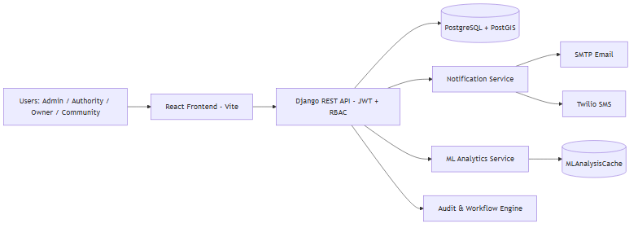
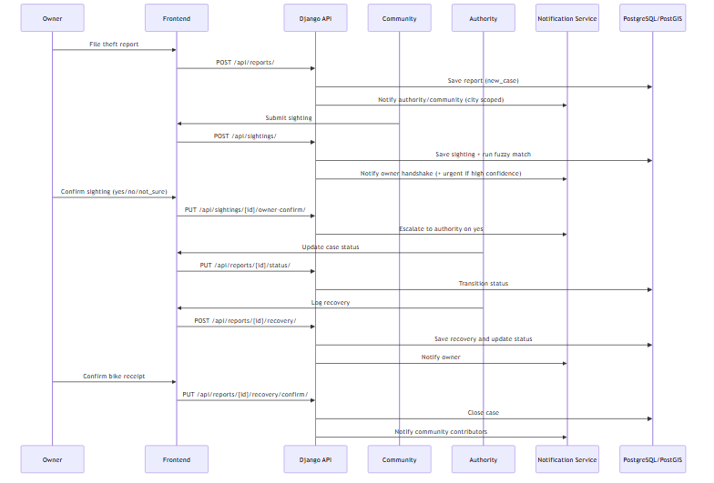
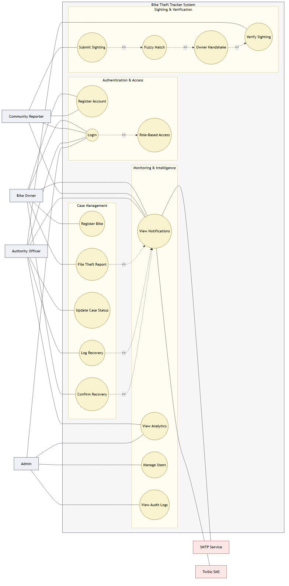
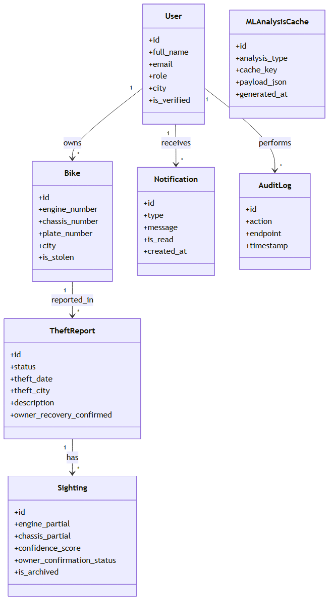
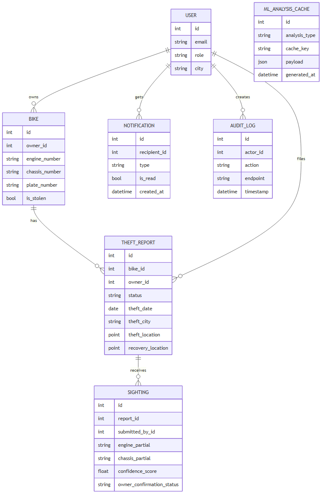
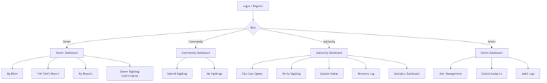

# Technical Requirement Document (TRD)

> Print-ready version for submission.  
> Recommended export: open this file in Markdown preview (or any Markdown editor) and print to PDF on A4, portrait.

## Cover Page

**Group No.** 58  
**Project Title** Bike Theft Tracker  
**BS Computer Science**  
**Batch** 2022F  
**Supervisor Name** ____________________  
**Supervisor Designation** ____________________  
**SSUET**

### Submitted By

- 2022F-BSCS-XXX - Student Name
- 2022F-BSCS-XXX - Student Name
- 2022F-BSCS-XXX - Student Name
- 2022F-BSCS-XXX - Student Name

Department of Computer Science & Information Technology  
Sir Syed University of Engineering & Technology  
University Road, Karachi 75300  
[http://www.ssuet.edu.pk](http://www.ssuet.edu.pk)

---

## Second Title Page

**Technical Requirement Document**  
**Group No.** 58  
**Project Title** Bike Theft Tracker  
**BS Computer Science**  
**Batch** 2022F

**Supervisor Name** ____________________  
**Supervisor Designation** ____________________  
**SSUET**

- 2022F-BSCS-XXX - Student Name
- 2022F-BSCS-XXX - Student Name
- 2022F-BSCS-XXX - Student Name
- 2022F-BSCS-XXX - Student Name

In Partial Fulfillment  
Of the Requirements for the Degree  
Bachelor of Science in Computer Science

Department of Computer Science & Information Technology  
Sir Syed University of Engineering & Technology  
University Road, Karachi 75300  
[http://www.ssuet.edu.pk](http://www.ssuet.edu.pk)

November 2025

---

## Declaration

We hereby declare that this project report entitled **"Bike Theft Tracker"** submitted to the Department of Computer Science and Information Technology is a record of original work done by us under the guidance of our supervisor, and no part has been plagiarized without citations. This work is submitted in partial fulfillment of the requirements for the degree of Bachelor of Science in Computer Science.

Name: Student Name - Signature: ____________________  
Name: Student Name - Signature: ____________________  
Name: Student Name - Signature: ____________________  
Name: Student Name - Signature: ____________________

Supervisor: ____________________  
Designation: ____________________  
Signature: ____________________  
Date: ____________________

---

## Abstract

Motorcycle theft is a frequent urban crime problem in Pakistan, while existing reporting mechanisms are mostly manual, fragmented, and slow to coordinate among citizens, bike owners, and authorities. Victims often face delayed response times, weak case visibility, and limited technical support for identifying stolen bikes from partial information.

The Bike Theft Tracker addresses this gap through a role-based web platform that digitizes the full theft-to-recovery lifecycle. The system supports four roles (Admin, Authority, Owner, Community), secure authentication, bike registration, theft report submission, community sighting intake, and city-scoped notifications. A structured case workflow enables authority officers to progress cases from intake to recovery, while owners confirm key sightings and final bike receipt.

The project also integrates data-driven intelligence modules, including fuzzy matching for partial engine/chassis identifiers, theft hotspot analysis using DBSCAN clustering, trend analytics, recovery radius statistics, and theft-to-recovery corridor analysis. Spatial capabilities are enabled using PostgreSQL with PostGIS for location-aware querying.

Compared to conventional crime reporting solutions, the proposed system improves traceability, role accountability, and inter-role synchronization through real-time notifications and audit trails. The platform is implemented using Django REST Framework and React, with security controls such as JWT, throttling, RBAC, and immutable audit logs. The expected outcome is improved reporting efficiency, faster verification, and better resource planning for authorities.

Future enhancements include mobile app deployment, multilingual interfaces, GIS heatmap visualization improvements, and direct integration with external law-enforcement systems.

---

## Table of Content

1. Chapter 1 - Introduction  
2. Chapter 2 - Literature Review  
3. Chapter 3 - Requirement Specifications  
4. Chapter 4 - System Design  
5. Chapter 5 - Business Model  
6. References

---

## List of Figures

1. Figure 1 - System Architecture Diagram  
2. Figure 2 - UML Sequence Diagram (Case Flow)  
3. Figure 3 - UML Use Case Diagram  
4. Figure 4 - UML Class Diagram (Core Entities)  
5. Figure 5 - Database Design Diagram  
6. Figure 6 - GUI/User Flow Wireframe

---

## List of Tables

1. Table 1 - Functional Requirements  
2. Table 2 - Comparative Feature Analysis  
3. Table 3 - Cost Estimation

---

## Chapter 1: Introduction

### 1.1 Background of Study

Urban motorcycle theft has become a recurring security and economic issue. Traditional reporting methods rely on physical FIR processes, disconnected records, and delayed citizen-to-authority communication. As a result, timely intervention is difficult and stolen vehicle recovery rates remain suboptimal.

The Bike Theft Tracker project belongs to the domain of public safety information systems and digital crime reporting. It provides a centralized platform where owners can register bikes and report thefts, community users can submit sightings, authorities can investigate with structured workflows, and administrators can monitor system health and accountability.

### 1.2 Project Objectives

1. Digitize and standardize the motorcycle theft reporting and tracking lifecycle.
2. Enable secure role-based access for Admin, Authority, Owner, and Community users.
3. Improve theft detection through fuzzy matching and geospatial analytics.
4. Increase coordination speed using city-scoped, event-driven notifications.
5. Provide transparent and auditable case progression from report to closure.

### 1.3 Problem Statement

Current theft reporting ecosystems lack a unified digital process that connects owners, the public, and authorities in real time. This causes delayed sighting validation, weak data consistency, limited analytics, and low visibility into investigation progress. A technically integrated and secure platform is needed to reduce response delay and support evidence-based action.

### 1.4 Scope of Study

The scope covers web-based theft case management for motorcycles, including:

- User registration, login, verification, and role enforcement.
- Bike registration and ownership-bound theft reporting.
- Community sighting submission with optional evidence image.
- Authority-driven case lifecycle and recovery logging.
- Owner confirmation handshake for suspected matches.
- Notification delivery (in-app, email, and optional SMS integration).
- ML-assisted analytics and geospatial reporting dashboards.

Out of scope:

- Direct integration with national police FIR databases (future work).
- Native Android/iOS applications (future phase).
- Hardware IoT bike tracker integration.

---

## Chapter 2: Literature Review

### 2.1 Existing Systems

#### 2.1.1 Title: Bike Index [1]
**Description:** A global bicycle registry for reporting and searching stolen bikes.  
**System Features:** Public registry, serial number lookup, theft report listing, ownership claims.

#### 2.1.2 Title: 529 Garage [2]
**Description:** A community-assisted bike safety and theft prevention platform used by communities and law enforcement.  
**System Features:** Bike registration, community alerts, incident sharing, prevention-oriented engagement.

#### 2.1.3 Title: Police Crime Reporting Portals (Generic e-policing portals) [3]
**Description:** Government-led web systems for online complaint/FIR submission and case status inquiry.  
**System Features:** Complaint submission, case reference tracking, departmental routing, limited public analytics.

#### 2.1.4 Title: Citizen Reporting Apps (community incident apps) [4]
**Description:** Mobile/web apps where citizens report suspicious incidents to relevant authorities.  
**System Features:** Geo-tagged reports, media uploads, event feeds, notification alerts.

### 2.2 Proposed System

The proposed Bike Theft Tracker combines structured case management, role-based workflows, and data intelligence in one platform. It is designed specifically for motorcycle theft with owner-community-authority synchronization and supports city-specific operations with geospatial analysis.

### 2.3 Comparative Analysis

Table 2 compares major features:

| Feature | Bike Index | 529 Garage | Generic Police Portals | Citizen Incident Apps | Proposed Bike Theft Tracker |
|---|---|---|---|---|---|
| Dedicated bike registry | Yes | Yes | Limited | No | Yes |
| Community sightings | Partial | Yes | Limited | Yes | Yes |
| Role-based authority workflow | Limited | Limited | Partial | No | Yes |
| Theft state machine | No | No | Partial | No | Yes |
| Fuzzy matching (partial IDs) | No | No | No | No | Yes |
| Geospatial hotspot/corridor analytics | No | Limited | Limited | Partial | Yes |
| Owner confirmation handshake | No | No | No | No | Yes |
| City-scoped alerts | Limited | Limited | Partial | Partial | Yes |
| Immutable audit trail | No | No | Limited | No | Yes |

Selected differentiating features for this project:
1. Full theft case state machine.
2. Owner sighting confirmation handshake.
3. Fuzzy matching for incomplete identifiers.
4. Geospatial theft hotspot and recovery analysis.
5. City-based notification routing.
6. Immutable audit logging for accountability.

---

## Chapter 3: Requirement Specifications

### 3.1 External Interface Requirements

#### 3.1.1 User Interfaces

- Responsive web UI for all roles.
- Separate dashboards for Admin, Authority, Owner, and Community.
- Forms for registration, bike entry, theft reporting, sighting submission.
- Reports and analytics pages with role-specific data visibility.
- Notification center with read/unread actions.

#### 3.1.2 Hardware Interfaces

- Client side: standard desktop/laptop/mobile browser device.
- Server side: host machine supporting Python runtime and PostgreSQL/PostGIS.
- Optional smartphone camera hardware for uploading sighting photos.
- Optional SMS gateway hardware/network channel via Twilio services.

#### 3.1.3 Software Interfaces

- **Backend:** Python 3.12+, Django 6.0, Django REST Framework 3.17.
- **Frontend:** React 19, Vite 8, Tailwind CSS 4.
- **Database:** PostgreSQL 15 with PostGIS 3.x.
- **Authentication:** JWT via `djangorestframework-simplejwt`.
- **ML/Analytics:** scikit-learn, pandas, numpy, rapidfuzz.
- **Messaging/Notifications:** SMTP email service and Twilio SMS API.
- **Testing:** Pytest + Playwright for backend and E2E validation.

Key data/message exchange:
- Incoming: user credentials, bike details, theft reports, sightings, status updates.
- Outgoing: JWT tokens, report states, match scores, analytics payloads, notifications.

#### 3.1.4 Communications Interfaces

- REST API over HTTP/HTTPS (`/api/*`).
- JSON message format for request/response payloads.
- Browser-server communication through secure token-authenticated endpoints.
- Email communication via SMTP.
- SMS communication via Twilio API.
- Security controls include TLS in production, throttling, and token-based authorization.

### 3.2 Functional Requirements

**Table 1: Functional Requirements**

| ID | Requirement |
|---|---|
| REQ-1 | System shall allow users to register and authenticate based on assigned roles. |
| REQ-2 | System shall allow owners to register bikes and file theft reports for owned bikes only. |
| REQ-3 | System shall allow community users to submit sightings with partial identifiers and optional images. |
| REQ-4 | System shall provide authority users with controlled case status transitions and recovery logging. |
| REQ-5 | System shall notify relevant users based on city and event type (theft filed, sighting matched, recovery updates). |
| REQ-6 | System shall perform fuzzy matching on partial engine/chassis numbers to identify likely report links. |
| REQ-7 | System shall provide analytics endpoints for hotspots, trends, corridor, and radius analysis. |
| REQ-8 | System shall maintain an append-only audit trail for sensitive activities. |
| REQ-9 | System shall enforce role-based access restrictions on all protected resources. |
| REQ-10 | System shall allow owner confirmation for sighting match and final recovery closure. |

### 3.3 Other Nonfunctional Requirements

#### 3.3.1 Performance Requirements

- API response time for common CRUD endpoints should be under 2 seconds under normal load.
- Analytics endpoints should return cached results where available to avoid repeated heavy computation.
- Platform should support concurrent multi-user access in typical departmental and academic demo usage.

#### 3.3.2 Safety Requirements

- Input validation for all forms and APIs to prevent invalid case data.
- Controlled case transitions to avoid accidental closure or unauthorized updates.
- Soft-delete strategy for selected records to preserve recovery and audit information.

#### 3.3.3 Security Requirements

- JWT-based authenticated sessions for API access.
- Role-based authorization checks per endpoint and object ownership constraints.
- Password policy and secure hashing through Django auth.
- API throttle controls for anonymous and authenticated traffic.
- Secure headers and production HTTPS policy configuration.
- Audit logs for traceability of privileged actions.

#### 3.3.4 Software Quality Attributes

- **Adaptability:** Modular Django app design (`users`, `bikes`, `reports`, `sightings`, `notifications`, `ml`).
- **Availability:** Local deployment automation scripts for quick startup/reset.
- **Correctness:** Extensive automated tests (backend + E2E) with high coverage target.
- **Maintainability:** Layered architecture with serializers, services, and API views.
- **Reliability:** Workflow constraints and deterministic status transitions.
- **Robustness:** Validation against duplicate, invalid, unauthorized, and cross-city actions.
- **Usability:** Role-focused dashboards and guided workflows for non-technical users.

### 3.4 Cost Estimation

**Table 3: Estimated Cost (PKR)**

| S.No | Project Expenditure | Cost in Rupees (PKR) |
|---|---|---:|
| 1 | Software Tools and API |  |
| 1.1 | Python, Django, React, PostgreSQL, PostGIS (open source) | 0 |
| 1.2 | Twilio API (testing quota / limited usage) | 8,000 |
| 1.3 | Development tools (VS Code/Cursor, browser tools) | 0 |
|  | **Sub Total** | **8,000** |
| 2 | Hardware Cost |  |
| 2.1 | Existing student laptops (4 x shared use allocation) | 0 |
| 2.2 | Optional external storage / backup media | 5,000 |
|  | **Sub Total** | **5,000** |
| 3 | Networking Cost |  |
| 3.1 | Internet usage during development/testing (project share) | 12,000 |
|  | **Sub Total** | **12,000** |
| 4 | Domain Name and Hosting Cost |  |
| 4.1 | Domain registration (`.com` 1 year estimate) | 4,000 |
| 4.2 | VPS/Cloud hosting (basic annual estimate) | 35,000 |
|  | **Sub Total** | **39,000** |
|  | **Grand Total** | **64,000 PKR** |

Note: Costs are estimated and may vary by provider and exchange rate.

---

## Chapter 4: System Design

### 4.1 System Architecture Diagram

**Figure 1: High-level Architecture Diagram**

Description:  
The frontend communicates with the backend using REST APIs. Backend modules enforce role-based business rules and persist data in PostgreSQL/PostGIS. ML services process theft and recovery data for analytics. Notification services handle event-driven alerts across roles.

### 4.2 High Level Design: System Operations (UML Sequence)

**Figure 2: Theft-to-Recovery UML Sequence**

### 4.3 High Level Design: System Model (UML Use Case)

**Figure 3: UML Use Case Diagram**

### 4.4 Low Level Design (UML Class Diagram)

**Figure 4: UML Class Diagram**

### 4.5 Database Design

**Figure 5: Physical Database / ER Diagram**

### 4.6 GUI Design

**Figure 6: GUI User Flow Diagram**

---

## Chapter 5: Business Model

### 5.1 Business Model Canvas

#### 5.1.1 Key Partners

- Local law enforcement and traffic police departments.
- City administration/public safety departments.
- Cloud hosting providers and SMS/email service providers.
- Educational/research collaborators for analytics improvement.

#### 5.1.2 Key Activities

- Platform development and maintenance.
- Theft report workflow monitoring and incident routing.
- Data analytics generation and dashboard updates.
- User onboarding, support, and awareness campaigns.

#### 5.1.3 Key Resources

- Software platform (frontend/backend codebase).
- Database and geospatial data infrastructure.
- Development team and domain supervisor guidance.
- Cloud resources and communication APIs.

#### 5.1.4 Value Propositions

- Faster digital reporting of bike theft incidents.
- Structured collaboration among owner, community, and authority.
- Better theft detection using fuzzy matching and GIS analytics.
- Transparent status tracking and improved trust via auditability.

#### 5.1.5 Customer Relationships

- Self-service web portal for registration and reporting.
- Notification-based engagement throughout case lifecycle.
- Administrative support for authority onboarding and governance.

#### 5.1.6 Channels

- Web application (desktop/mobile browser).
- Email and in-app notification channels.
- Future: social outreach and integration with municipal systems.

#### 5.1.7 Cost Structure

- Core platform hosting and maintenance.
- Notification API usage (SMS/email).
- Development, testing, and infrastructure operations.
- Security hardening and periodic upgrades.

Business orientation: **Value-driven** (public safety impact first) with cost optimization through open-source stack.

#### 5.1.8 Revenue Streams

Potential long-term models:

- Government/municipal deployment contracts.
- SaaS subscription for city-level departments.
- Institutional licensing for custom analytics deployments.
- Premium reporting/insight modules for partner organizations.

For academic deployment, no direct revenue is assumed.

---

## References (IEEE Style)

[1] Bike Index, "Bike Index," 2025. [Online]. Available: [https://bikeindex.org](https://bikeindex.org). [Accessed: 04-May-2026].  
[2] 529 Garage, "Project 529 / 529 Garage," 2025. [Online]. Available: [https://project529.com/garage](https://project529.com/garage). [Accessed: 04-May-2026].  
[3] National Police Foundation (Pakistan), "Police Khidmat Markaz / e-policing services," 2025. [Online]. Available: [https://pkm.punjabpolice.gov.pk](https://pkm.punjabpolice.gov.pk). [Accessed: 04-May-2026].  
[4] Safecity, "Safecity: crowdsourced incident reporting platform," 2025. [Online]. Available: [https://www.safecity.in](https://www.safecity.in). [Accessed: 04-May-2026].  
[5] Django Software Foundation, "Django Documentation 4.2," 2025. [Online]. Available: [https://docs.djangoproject.com/en/4.2/](https://docs.djangoproject.com/en/4.2/). [Accessed: 04-May-2026].  
[6] PostgreSQL Global Development Group, "PostgreSQL Documentation," 2025. [Online]. Available: [https://www.postgresql.org/docs/](https://www.postgresql.org/docs/). [Accessed: 04-May-2026].  
[7] PostGIS Project Steering Committee, "PostGIS Documentation," 2025. [Online]. Available: [https://postgis.net/documentation/](https://postgis.net/documentation/). [Accessed: 04-May-2026].  
[8] Scikit-learn Developers, "scikit-learn User Guide," 2025. [Online]. Available: [https://scikit-learn.org/stable/user_guide.html](https://scikit-learn.org/stable/user_guide.html). [Accessed: 04-May-2026].  
[9] RapidFuzz Contributors, "RapidFuzz Documentation," 2025. [Online]. Available: [https://rapidfuzz.github.io/RapidFuzz/](https://rapidfuzz.github.io/RapidFuzz/). [Accessed: 04-May-2026].

