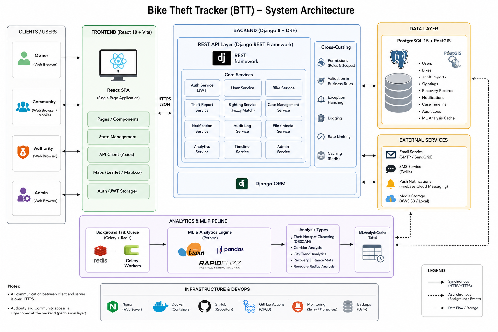
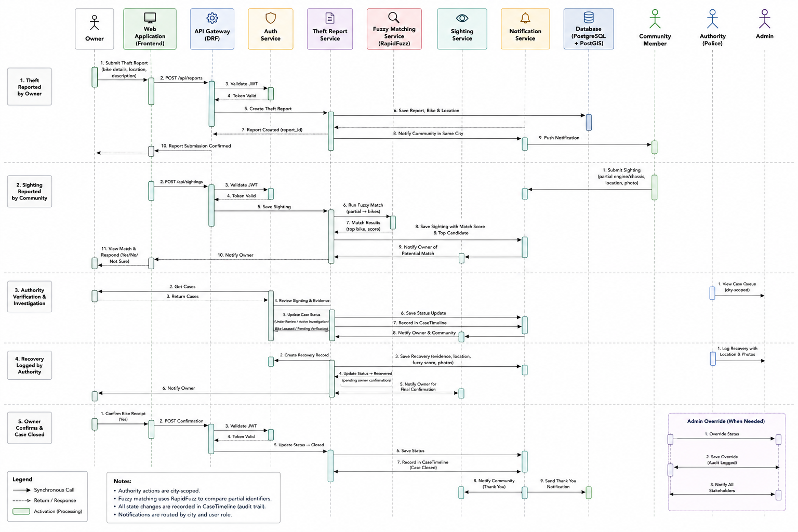
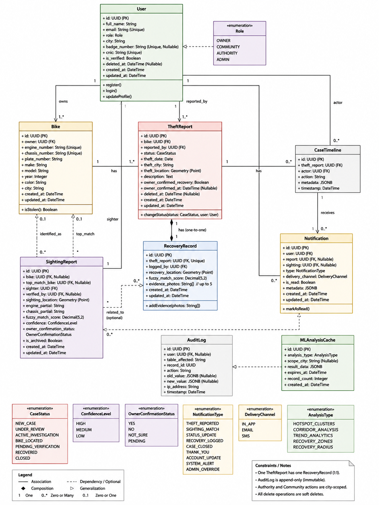
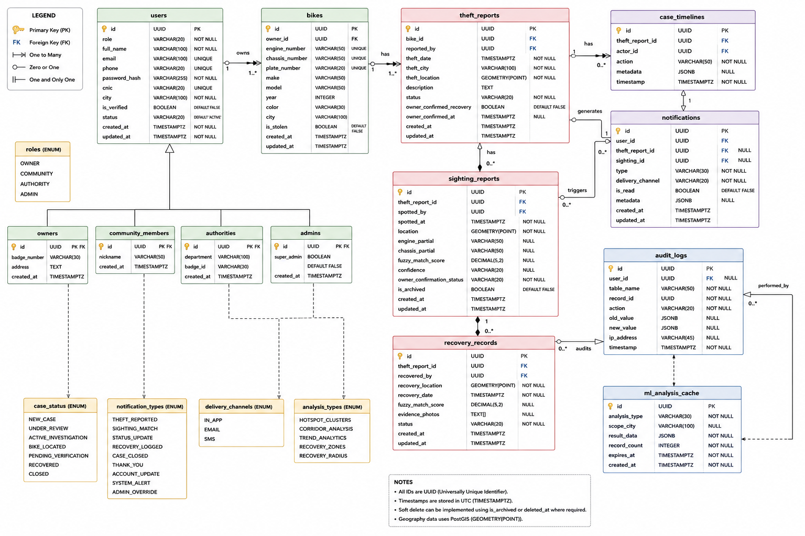

# Technical Requirement Document (TRD)

> Print-ready version for submission.
> Recommended export: open this file in Markdown preview (or any Markdown editor) and print to PDF on A4, portrait.

## Cover Page

**Technical Requirement Document**

**Group No. 58**

**Bike Theft Tracker**
**A Role-Based Platform for Motorcycle Theft Reporting, Community Sighting, and Geospatial Recovery Analytics**

**BS Computer Science**
**Batch 2022F**

**Supervisor: ____________________**
____________________, SSUET

**Submitted by**

**2022F-BSCS-XXX — Student Name**
**2022F-BSCS-XXX — Student Name**
**2022F-BSCS-XXX — Student Name**
**2022F-BSCS-XXX — Student Name**


Department of Computer Science & Information Technology
Sir Syed University of Engineering & Technology
University Road, Karachi 75300
[http://www.ssuet.edu.pk](http://www.ssuet.edu.pk)

---

<div style="page-break-after: always;"></div>

## Declaration

This project report titled "Bike Theft Tracker: A Role-Based Platform for Motorcycle Theft Reporting, Community Sighting, and Geospatial Recovery Analytics" has been submitted to the Department of Computer Science and Information Technology under the supervision of ____________________, and none of its content has been copied from any other source without citing the source. This work is submitted in partial fulfillment of the requirements for the degree of Bachelor of Science in Computer Science.

Name: Student Name — Signature: ____________________
Name: Student Name — Signature: ____________________
Name: Student Name — Signature: ____________________
Name: Student Name — Signature: ____________________

Supervisor: ____________________
Designation: ____________________
Signature: ____________________
Date: ____________________

---

<div style="page-break-after: always;"></div>

## Acknowledgments

We would like to thank our supervisor for the guidance and the time given to this project across its design, development, and testing phases, and for pushing us to fix problems properly rather than around them. We are grateful to the Department of Computer Science and Information Technology at SSUET for the resources made available to us over the course of the degree.

We also want to acknowledge each other's work on this team: the backend, the frontend, the machine-learning modules, and the testing effort were built by four people working on separate parts of the same system, and the project would not hold together without every part doing its job. Finally, thanks to our families for the support during the months this project took to build.

---

<div style="page-break-after: always;"></div>

## Copyright

The copyright of this report belongs to the authors under the terms of the Copyright Act 1987 as qualified by the Intellectual Property Policy of Sir Syed University of Engineering and Technology. Due acknowledgement shall always be made of the use of any material contained in, or derived from, this report.

© Batch 2022F, Department of Computer Science & Information Technology. All rights reserved.

---

<div style="page-break-after: always;"></div>

## Abstract

Karachi loses motorcycles to theft at a rate that outpaces the tools citizens have to report or track them. CPLC-sourced data covering March 2026 alone puts the figure at 3,467 motorcycles taken in the city — 3,027 stolen from parked positions and 440 snatched at gunpoint, an 11% rise in parked-bike theft over the previous month and an average of roughly 112 bikes a day [1]. The city's Rs. 1.4 billion Safe City camera network covers about 40 fixed points, mostly toll plazas and entry roads, which leaves residential streets, where most bikes are actually taken from, outside its reach [1]. The reporting side has the same shape: CPLC's own stolen-vehicle service is a 24/7 call centre and web form that relays a report into a central database by phone or manual entry, with no self-service case tracking for the citizen who filed it and no channel for a stranger who spots the bike later to say so [2]. Punjab's Anti-Vehicle Lifting System (AVLS) solves the cross-district database problem but is a police-internal tool, not something an owner or a bystander can use directly, and it does not operate in Sindh [3].

Bike Theft Tracker (BTT) is a web platform that puts owner, community, and police investigation on the same record instead of three disconnected ones. Four roles share a single case built around a motorcycle's engine and chassis numbers: Owner, Community Reporter, Police Authority, and Admin. An owner registers a bike and can file a theft report against it in one step; a bystander who sees a bike they suspect is stolen can submit a sighting with only a partial, damage-obscured engine or chassis number and an optional photo, without needing to know which case it belongs to. That partial number is matched against every bike under an active theft report using rapidfuzz's WRatio scorer, calibrated at two thresholds (medium ≥ 70, high ≥ 85) tuned specifically for alphanumeric codes that have been misread, partly worn off, or partly memorised. A case moves through a nine-state lifecycle, from `new_case` through investigation, a located-bike stage, an owner-verification handshake, and recovery. Two separate layers enforce it: the model defines which state transitions are structurally possible at all, and a role-scoped whitelist decides which of those an authority officer is allowed to trigger directly, closing off the specific shortcut (moving a case straight from `pending_verification` to `recovered` without the owner's confirmation) that an earlier version of the system left open.

Underneath the workflow, PostGIS-backed location data feeds four analytics jobs that a district authority account can read from a dashboard rather than compute by hand: DBSCAN clustering of recent theft locations into hotspots, a companion DBSCAN pass over theft-to-recovery displacement vectors that groups recovered cases into named compass-bearing corridors, city-level month-over-month trend and recovery-rate aggregation, and straight-line recovery-distance statistics. Every privileged write is recorded in an audit log that the database itself, not just the application, refuses to update or delete, enforced through a `REVOKE UPDATE, DELETE` grant change applied in a migration rather than left to convention. The backend is Django 6 and Django REST Framework on PostgreSQL 15 with PostGIS; the frontend is React 19 on Vite; authentication is JWT with short-lived access tokens, rotating refresh tokens, and a blacklist on logout. The backend test suite is gated at a minimum 90% branch-coverage floor enforced by `pytest.ini` (`--cov-fail-under=90`) on every local run; no CI pipeline runs it automatically yet (Section 8.5). A fresh run ahead of this report passed all 386 tests at 92.79% coverage (Section 8.1).

The result is a platform where a report filed by an owner, a sighting filed by a stranger, and a case closed by a police officer are three views of the same object rather than three separate paper trails, and where the geospatial patterns in theft and recovery data are computed once, cached, and made visible to the people who can act on them.

---

<div style="page-break-after: always;"></div>

## Table of Contents

1. Chapter 1 — Introduction
2. Chapter 2 — Literature Review
3. Chapter 3 — Requirement Specifications
4. Chapter 4 — System Design
5. Chapter 5 — Business Model
6. Chapter 6 — System Development Methodology
7. Chapter 7 — System Testing and Evaluation
8. Chapter 8 — Results and Discussion
9. Chapter 9 — Conclusion and Future Work
10. References

---

<div style="page-break-after: always;"></div>

## List of Figures

1. Figure 4.1 — System Architecture Diagram
2. Figure 4.2 — UML Sequence Diagram (Theft-to-Recovery Case Flow)
3. Figure 4.3 — UML Use Case Diagram
4. Figure 4.4 — UML Class Diagram (Core Entities)
5. Figure 4.5 — Database Design (Entity-Relationship Diagram)
6. Figure 4.6 — GUI / User Flow Diagram
7. Figure 5.1 — Business Model Canvas
8. Figure 6.1 — Software Development Cycle
9. Figure 6.2 — Project Plan with Gantt Chart
10. Figure 7.1 — Software Testing Life Cycle
11. Figure 7.2 — Bug Life Cycle

---

<div style="page-break-after: always;"></div>

## List of Tables

1. Table 2.3 — Comparative Analysis of Existing Systems
2. Table 3.1.2 — Hardware Interfaces
3. Table 3.1.3 — Software Interfaces
4. Table 3.2 — Functional Requirements
5. Table 3.3.1 — Throttle Rates
6. Table 3.3.4 — Software Quality Attributes
7. Table 3.4 — Cost Estimation
8. Table 5.1.7 — Cost Structure
9. Table 5.3 — Competitive Positioning
10. Table 6.2 — Key Milestones
11. Table 6.4 — Tools Used for Development
12. Table 6.4.4 — Worked Fuzzy-Match Example
13. Table 6.4.7 — DBSCAN Parameters by Analysis Job
14. Table 7.5 — Test Environment
15. Table 7.8 — Test Cases
16. Table 7.9.2 — Bug Severity Definitions
17. Table 7.9.3 — Bug Priority Definitions
18. Table 7.9.5 — Bug Reports Summary
19. Table 7.10 — User Acceptance Testing
20. Table 8.1 — Backend Test Suite Results
21. Table 8.1b — Coverage by Selected Module
22. Table 8.3 — Requirement Fulfilment Summary

---

<div style="page-break-after: always;"></div>

## Chapter 1: Introduction

### 1.1 Background of Study

Motorcycle theft in Karachi is not a marginal problem. CPLC-sourced figures for March 2026 record 3,027 motorcycles stolen from parked positions and a further 440 snatched at gunpoint — 3,467 in total, an 11% increase in parked-bike theft over February's 2,726, and an average of about 112 bikes taken every day of the month [1]. The city's response to street crime has leaned heavily on the Safe City surveillance programme, a roughly Rs. 1.4 billion investment in camera coverage and facial recognition. That coverage sits at about 40 fixed locations, concentrated at toll plazas and major entry points, which means the residential streets and parking spots where most bikes actually disappear from are not watched at all, and the cameras that do exist depend on a rapid police response to a live facial-recognition hit that, by most reporting, does not consistently happen [1]. A camera network answers "where did this happen," not "where is the bike now" or "did anyone see it move" — and neither question has a citizen-facing answer today.

The formal reporting channel, run by the Citizens-Police Liaison Committee (CPLC), is built around a 24/7 call centre: an owner phones in a registration number, make, colour, and location, the operator relays it to Police Control for broadcast, and the details are entered into a central database [2]. It is fast to file and it does put a record into a shared system, which is more than nothing — but the citizen who called does not get a case reference to check later, and there is no channel at all for the sighting side: someone who spots the bike three weeks later, in a different neighbourhood, with a plate that has since been swapped, has no structured way to connect what they saw back to the original report. Punjab runs a more capable back-end system, the Anti-Vehicle Lifting System (AVLS), which does integrate the FIR database, the Excise and Taxation Department, and the Punjab Forensic Science Agency into one province-wide record and pushes SMS alerts through a case dashboard [3]. It solves the fragmentation problem CPLC has, but it is built for police use, not citizen use, and it does not run in Sindh at all, so it does not reach the city with the theft numbers cited above.

Outside Pakistan, two platforms have solved the community-participation half of this problem for bicycles: Bike Index maintains an open, searchable global registry of bicycle serial numbers and stolen-bike listings that amplifies a theft report to partner shops, other registrants, and social media [4], and Project 529's Garage app pushes a stolen-bike alert to nearby registered members the moment it is filed, a design credited with theft reductions of up to 40% in cities where it has seen heavy adoption [5]. Neither is built around the identifiers, workflows, or investigative role structure a police-involved motorcycle case needs — there is no authority role, no case state machine, and no attempt to match a damaged or partially remembered engine or chassis number against an open case. A closer academic precedent exists: a 2017 system built for Nigeria combined vehicle registration with a community-participation theft-alert channel over the web [6], which validates the idea that citizen sightings speed up recovery, but it stops short of matching partial identifiers, computing where thefts cluster, or giving police a structured case to work from.

Bike Theft Tracker sits in the gap those five systems leave between them: a citizen-facing platform, specific to motorcycle theft, that gives owners, the public, and police officers a single shared case record, matches partial and damaged identifiers automatically, and turns the location data every report already contains into hotspot and recovery-corridor analytics a district authority account can actually read.

### 1.2 Problem Statement

No platform available to a Karachi motorcycle owner today combines four things at once: a citizen-facing report that produces a trackable case rather than a phone-relayed database entry; a way for a stranger to submit a partial or damaged identifier and have it matched automatically against open cases; a structured, role-gated investigation workflow that a police officer can actually work a case through, rather than a flat status field; and geospatial intelligence — where thefts cluster, which routes stolen bikes travel before recovery — computed from the reports the system already holds rather than left for someone to tabulate by hand. CPLC covers the first item only partially, AVLS covers the third for police in Punjab alone, and the community-alert platforms (Bike Index, Project 529, and the 2017 Nigerian system) cover the second without the other three. The result, for a bike owner in Karachi specifically, is that filing a report and getting a useful lead back from it are two separate, mostly disconnected processes.

### 1.3 Project Objectives

1. Build a single web platform where a bike owner's theft report, a community member's sighting, and a police officer's investigation are views of the same case record rather than separate, unlinked entries.
2. Enforce four distinct roles (Owner, Community Reporter, Police Authority, and Admin) with permission checks applied per endpoint and per object, not only per page.
3. Model theft-case progress as an explicit, guarded state machine (`new_case` → `under_review` → `active_investigation` → `bike_located` → `pending_verification` → `recovered` → `closed`, with a `closed` exit available from most states) so that a case cannot skip the owner-confirmation step on the way to being marked recovered.
4. Match partial or damaged engine and chassis numbers submitted in a community sighting against every bike currently under an active theft report, using a fuzzy-matching scorer calibrated with an explicit medium/high confidence threshold rather than an exact-match lookup.
5. Route notifications to the right people automatically: same-city authority officers and community members when a theft is reported, the owner when a sighting scores above the alert threshold, and an escalation to authority if the owner does not respond to a sighting match within a set window.
6. Compute theft hotspots, theft-to-recovery corridors (labelled by compass bearing), month-over-month city trends, and recovery-distance statistics directly from stored report and recovery locations, cached rather than recomputed on every dashboard load.
7. Make every privileged state change — status transitions, recovery logging, user administration — traceable through an audit log that cannot be altered or deleted after the fact, by database-level grant as well as application logic.
8. Keep the platform free to run on an open-source stack (Django, PostgreSQL/PostGIS, React) so that deployment cost is server hosting only, with no per-seat or per-API-call licensing.

### 1.4 Scope of Study

The scope covers a web-based theft case management platform for motorcycles, including:

- User registration, email verification, login, and role enforcement across four roles.
- Bike registration bound to an owner, keyed on unique engine and chassis numbers.
- Owner-initiated theft reporting, with automatic same-city notification of authority and community accounts.
- Community sighting submission against a partial engine or chassis number, with an optional evidence photo and automatic fuzzy matching.
- An owner confirmation ("yes / no / not sure") handshake on a sighting match, with automatic escalation to authority if the owner does not respond within the configured window.
- Authority-driven, whitelist-gated case status transitions and recovery logging, including a per-case timeline of actions.
- An immutable, database-enforced audit trail of privileged actions.
- Geospatial analytics: DBSCAN theft-hotspot clustering, theft-to-recovery corridor analysis, city trend analytics, and recovery-distance statistics, all cached and exposed through authority/admin-facing dashboards.
- Notification delivery through in-app alerts, with email and SMS (Twilio) service modules implemented and unit-tested but deliberately not yet wired into the live notification flow (Section 6.5.7).

Out of scope for the current build:

- Direct system integration with CPLC's or AVLS's own databases (a real-world data-sharing agreement, not a technical decision, would need to precede this).
- Native Android/iOS applications; the platform is a responsive web application only.
- Hardware GPS/IoT tracker integration on the bike itself.
- A production payment gateway (the platform does not currently monetise; see Chapter 5).

---

<div style="page-break-after: always;"></div>

## Chapter 2: Literature Review

The review below covers two kinds of prior work: systems already running that a Karachi bike owner could plausibly use today, and the published research behind the three techniques Bike Theft Tracker's own pipeline depends on — approximate string matching, density-based spatial clustering, and role-based access control. Both halves are used to place the exact gap this project fills.

### 2.1 Existing Systems

#### 2.1.1 CPLC — Report Lost / Stolen Vehicle [2]

The Citizens-Police Liaison Committee runs Sindh's primary citizen-facing vehicle-theft channel: a 24/7 call centre (numbers 1102, 021-35662222, 021-35682222) plus a web form, both of which collect the registration number, make, colour, and incident location and relay them to Police Control for broadcast and database entry.

System features:
- Phone and web intake of a stolen/snatched vehicle report.
- Manual relay to Police Control for broadcast to patrol units.
- Central database entry of the reported vehicle.
- No self-service case status tracking for the citizen who filed the report.
- No sighting-submission channel for a third party who later spots the vehicle.

#### 2.1.2 AVLS — Anti-Vehicle Lifting System, Punjab IT Board [3]

AVLS is a police-internal, web-based system that gives Punjab law enforcement a single province-wide stolen-vehicle database, replacing the earlier situation where each district kept separate, unintegrated records.

System features:
- Integration with the FIR database, the Excise and Taxation Department, and the Punjab Forensic Science Agency.
- Cross-district investigation and recovery tracking.
- SMS alerting and a centralised reporting dashboard.
- Police-only access — no citizen-facing report or sighting submission.
- Punjab-only; does not operate in Sindh.

#### 2.1.3 Bike Index [4]

Bike Index is a free, open, non-profit global bicycle registry with a stolen-bike recovery layer, holding over 1.3 million registered bikes and partnerships with law-enforcement and bike-shop networks across the United States.

System features:
- Free registration by serial number, photos, and component details.
- Public stolen-bike listing amplified through partner organisations and social media.
- Serial-number lookup usable by police and second-hand buyers.
- No authority role or investigative case workflow — a listing, not a case.
- Built for bicycles; no engine/chassis-number model or motorcycle-specific fields.

#### 2.1.4 Project 529 Garage [5]

Project 529 is a community bike-registration and recovery network built around a "crowd-connected" alert: when a registered bike is reported stolen, the Garage app pushes a notification to nearby registered members, functioning as a digital neighbourhood watch. Cities with heavy program adoption have reported theft reductions of up to 40%.

System features:
- Push-notification alert to nearby community members on a theft report.
- Bike-shop and police partner integration for registration.
- Community reporting of suspicious listings and sightings.
- No fuzzy or partial-identifier matching — alerts are keyed on exact registration, not damaged or partly-read serials.
- No structured multi-stage investigation workflow; recovery is reported back informally.

### 2.2 Proposed System

Bike Theft Tracker combines what the four systems above each do separately: CPLC and AVLS's structured, police-workable case record; Bike Index and Project 529's community participation; and, on top of both, two capabilities none of the four have — fuzzy matching of partial or damaged identifiers, and geospatial hotspot/corridor analytics computed from the platform's own report data. It is built specifically around motorcycle engine and chassis numbers rather than bicycle serial numbers or a bare vehicle-registration plate, and it is a citizen-facing web platform rather than a police-internal tool, while still giving police accounts (the Authority role) a workflow gated tightly enough to prevent the specific privilege-escalation gap described in Section 6.5.2.

### 2.3 Comparative Analysis

**Table 2.3: Comparative Analysis of Existing Systems**

| Feature | CPLC | AVLS | Bike Index | Project 529 | Bike Theft Tracker |
|---|---|---|---|---|---|
| Citizen-facing report submission | Yes (call/web) | No | Yes | Yes | Yes |
| Self-service case status tracking | No | No | Partial | Partial | Yes |
| Community sighting submission | No | No | Partial (social) | Yes | Yes |
| Partial/damaged identifier fuzzy matching | No | No | No | No | Yes |
| Structured, role-gated investigation workflow | No | Partial (internal) | No | No | Yes |
| Motorcycle-specific identifiers (engine/chassis) | Partial | Yes | No (bicycle) | No (bicycle) | Yes |
| Geospatial hotspot / corridor analytics | No | No | No | No | Yes |
| Immutable audit trail | Unknown/internal | Unknown/internal | No | No | Yes |
| Coverage | Sindh only | Punjab only | Global (US-heavy) | North America-heavy | Karachi / Pakistan-focused, city-configurable |
| Cost to user | Free | N/A (police tool) | Free | Free (registration) | Free |

Differentiating features carried into the design: a nine-state case workflow with a role-scoped transition whitelist (Section 6.5.2); fuzzy matching on partial engine/chassis numbers with calibrated confidence thresholds (Section 6.5.3); an owner-confirmation handshake before a sighting can close a case; DBSCAN-based hotspot and corridor analytics over PostGIS location data (Section 6.5.5); and a database-enforced, not just application-enforced, audit trail.

### 2.4 Research-Based Studies

Five works are reviewed below. Each maps directly onto a technique implemented in Bike Theft Tracker's backend, cited at the point in Chapter 6 where that technique is used.

#### 2.4.1 A Density-Based Algorithm for Discovering Clusters in Large Spatial Databases with Noise (DBSCAN)

Authors: Martin Ester, Hans-Peter Kriegel, Jörg Sander, and Xiaowei Xu (1996) [7]

Area of research: Density-based spatial clustering. The problem the authors addressed was that the clustering algorithms available at the time — k-means and hierarchical methods chief among them — require the number of clusters to be chosen in advance and struggle with clusters of irregular shape or with noise points that do not belong to any cluster. They proposed DBSCAN, which defines a cluster as a maximal set of density-connected points reachable from a core point within a radius `eps` given a minimum-points threshold `MinPts`, and does not require the number of clusters as an input. The method was evaluated against k-means and a hierarchical algorithm (CLARANS) on 2D spatial databases, and DBSCAN was shown to find clusters of arbitrary shape while explicitly labelling low-density points as noise rather than forcing them into a cluster, at a runtime the authors report as roughly linear given a spatial index. The user benefit is a clustering method that does not need a pre-set cluster count and tolerates outliers gracefully — exactly the property Bike Theft Tracker's hotspot job needs, since the number of theft clusters in a city changes month to month and a handful of one-off, geographically scattered thefts should not distort a cluster's centroid (Section 6.5.5).

#### 2.4.2 A Guided Tour to Approximate String Matching

Authors: Gonzalo Navarro (2001) [8]

Area of research: Approximate (fuzzy) string matching. The problem surveyed is searching for a pattern in a text, or comparing two strings, when exact equality is too strict — a query string may contain typos, substitutions, or transpositions relative to the string it is meant to match. The survey organises the field around edit distance (the minimum number of insertions, deletions, and substitutions needed to turn one string into another) and the algorithmic families built to compute or approximate it efficiently, covering both online search and whole-string comparison. Its central contribution is not a single new algorithm but a structured comparison of complexity trade-offs across dozens of published techniques, letting a practitioner choose an approach suited to a specific error model and alphabet size. The user benefit is a matching method that tolerates the kind of noisy input a person actually produces — a partially read, partly memorised, or damage-obscured code — rather than requiring a character-perfect match. This is the same principle behind Bike Theft Tracker's use of rapidfuzz's WRatio scorer to match a sighting's partial engine or chassis number against the alphanumeric codes on file, chosen specifically because it tolerates substitutions, deletions, and transpositions in exactly this kind of code (Section 6.5.3).

#### 2.4.3 Role-Based Access Control Models

Authors: Ravi S. Sandhu, Edward J. Coyne, Hal L. Feinstein, and Charles E. Youman (1996) [9]

Area of research: Access control model design. The problem addressed was that neither discretionary access control (permissions tied to individual users) nor mandatory access control (permissions tied to security clearances) fit the way permissions are actually assigned inside an organisation, where what a person can do is a function of their job, not their identity alone. The authors proposed a family of role-based access control (RBAC) models — RBAC0 through RBAC3 — in which permissions are assigned to roles and users are assigned to roles, with the more advanced models adding role hierarchies and separation-of-duty constraints. The paper does not report an experimental evaluation in the empirical sense; its contribution is the formal model family itself, which became the basis for the NIST RBAC standard adopted widely across enterprise and government systems since. The user benefit is that permission management scales with the number of roles rather than the number of users, and that a permission change (what an Authority officer may do) is made once, in one place, rather than user by user. Bike Theft Tracker's four-role model (Owner, Community, Authority, Admin), enforced through composable DRF permission classes and a further per-object ownership check (Section 3.3.3), is a direct application of this model — narrower than the full RBAC3 hierarchy, since the project's four roles do not nest, but built on the same "permissions belong to roles, not to users" principle.

#### 2.4.4 The Utility of Hotspot Mapping for Predicting Spatial Patterns of Crime

Authors: Spencer Chainey, Lisa Tompson, and Sebastian Uhlig (2008) [10]

Area of research: Applied crime-hotspot mapping methodology. The problem addressed was that several hotspot-mapping techniques were in police use — thematic mapping of administrative areas, spatial ellipses, grid thematic mapping, and kernel density estimation — with no clear evidence of which actually predicted where future crime would occur. The authors tested all four methods against real burglary, street-crime, and vehicle-theft data (including theft of and from vehicles specifically), scoring each on how well a hotspot drawn from one time period predicted crime locations in the following period. Results showed the four techniques varied significantly in predictive accuracy and that the ranking also shifted by crime type, with kernel density estimation performing most consistently well across categories. The user benefit is a validated basis for choosing a hotspot method for operational use rather than by convention, and the paper's specific inclusion of vehicle theft as a tested crime type is directly relevant to Bike Theft Tracker's own hotspot job. The project uses DBSCAN rather than kernel density estimation, for the property discussed in 2.4.1 (no pre-set cluster count, tolerant of noise), but the underlying question the study answers — does a hotspot computed from past incidents actually predict where the next ones cluster — is the same question the project's hotspot dashboard is built to answer for authority accounts (Section 6.5.5).

#### 2.4.5 Online System for Vehicle Ownership Tracking and Theft Alert with Community Participation

Authors: O. V. Mejabi, D. M. Abdulrahaman, M. A. Adeshina, R. A. Oyekunle, and J. S. Sadiku (2017) [6]

Area of research: Community-participation vehicle theft reporting. The problem the authors addressed, grounded in Nigerian National Bureau of Statistics figures showing 2,544 vehicles stolen and only 1,377 recovered over 2013–2015, was that formal reporting alone was not translating into recovery, and that citizens who might spot a stolen vehicle had no structured channel back to the report. The authors built a web-based system letting owners register vehicle and ownership profiles and letting the community submit sightings against those registrations, as a low-cost complement to GPS/GSM hardware trackers that not every owner can afford. The system was demonstrated as a working prototype rather than evaluated against recovery-rate data from a live deployment. The user benefit — and the reason this is the closest published system to Bike Theft Tracker in concept — is the same core idea: pairing an owner's registration with a community sighting channel, at zero hardware cost to the owner. It stops short of what Bike Theft Tracker adds on top: fuzzy matching of a partial identifier rather than requiring an exact plate/serial match, a multi-stage authority investigation workflow rather than a flat "reported/found" status, and geospatial clustering of theft and recovery locations. Bike Theft Tracker extends the same community-participation premise with a matching and analytics layer this earlier system does not have.

---

<div style="page-break-after: always;"></div>

## Chapter 3: Requirement Specifications

### 3.1 External Interface Requirements

#### 3.1.1 User Interfaces

The interface is a responsive single-page web application (React Router 7) with one dashboard entry point per role — `OwnerDashboard`, `CommunityDashboard`, `AuthorityDashboard`, and an `AdminDashboard` split into user management, analytics, and audit-log views. Route access is enforced by two guard components: `ProtectedRoute` checks authentication, and `RoleRoute` checks that the logged-in user's role matches what a given page requires, so a Community account cannot reach an Authority page by typing its URL directly. Shared UI primitives (buttons, modals, alerts, badges, confirm dialogs, data tables) live in a common component library so that the four dashboards look and behave consistently rather than diverging over time. Forms give inline validation before submission — for example, checking email or CNIC availability against the backend as the user types, through a dedicated `useAvailabilityCheck` hook, rather than only after a failed submit.

#### 3.1.2 Hardware Interfaces

Bike Theft Tracker is a web-based application and places no specialised hardware requirement on the end user. Minimum and recommended client-side specifications:

**Table 3.1.2: Hardware Interfaces**

| Component | Minimum | Recommended |
|---|---|---|
| Processor | Dual-core 1.6 GHz | Quad-core 2.0 GHz or higher |
| RAM | 4 GB | 8 GB |
| Storage | 200 MB free (browser cache) | 500 MB free |
| Display | 1280 × 720 | 1920 × 1080 |
| Internet | 2 Mbps | 10 Mbps or higher |
| Camera (optional) | Any smartphone camera, for sighting evidence photos | — |

On the development side, the backend requires a machine capable of running Python 3.12+ with GDAL/GEOS libraries available for PostGIS support, and a PostgreSQL 15 server with the PostGIS extension enabled.

#### 3.1.3 Software Interfaces

**Table 3.1.3: Software Interfaces**

| Software | Version / Details |
|---|---|
| Web Browser | Chrome 90+, Firefox 88+, Edge 90+, Safari 14+ |
| Backend runtime | Python 3.12+ |
| Web framework | Django 6.0.8 |
| API framework | Django REST Framework 3.17.1 |
| Auth | djangorestframework-simplejwt 5.5.1 (JWT) |
| Database driver | psycopg[binary] 3.3.4 (psycopg3) |
| Database | PostgreSQL 15 with PostGIS |
| Filtering | django-filter 26.1 |
| Fuzzy matching | rapidfuzz 3.14.5 |
| ML / analytics | scikit-learn 1.9.0, pandas 3.0.5, numpy 2.5.1 |
| Image handling | Pillow 12.3.0, python-magic |
| SMS (implemented, not yet live-wired) | twilio 9.10.9 |
| Geometry (Windows dev) | rasterio 1.5.0, shapely 2.1.2 |
| Testing | pytest 9.1.1, pytest-django, pytest-cov, factory-boy |
| Frontend framework | React 19.2.8, react-router-dom 7.18.2 |
| Build tool | Vite 8.2.0 (Rolldown bundler) |
| Styling | Tailwind CSS 4.3.3 |
| HTTP client | axios 1.19.0 |
| E2E testing | Playwright 1.62.1 |

Key data/message exchange:
- Incoming: user credentials, bike details, theft reports, sightings with optional images, owner confirmations, status transitions, recovery records.
- Outgoing: JWT access/refresh tokens, case and sighting state, fuzzy-match confidence scores, notification payloads, analytics results (hotspots, corridors, trends, recovery-radius statistics).

#### 3.1.4 Communications Interfaces

- Protocol: client-server traffic is JSON over HTTP(S); production deployment is expected to sit behind a reverse proxy terminating TLS, since the Django project itself does not configure a CORS policy and instead relies on same-origin serving (Section 3.3.3).
- API style: REST JSON, mounted per app under `/api/<app>/` (`/api/users/`, `/api/bikes/`, `/api/reports/`, `/api/sightings/`, `/api/notifications/`, `/api/ml/`).
- Authentication: Bearer JWT on every authenticated request, issued by `/api/users/token/` and refreshed silently by the frontend's axios interceptor on a 401, with `/api/auth/`-prefixed endpoints explicitly excluded from the refresh retry so a wrong password is not mistaken for an expired session.
- Errors: JSON error bodies with a message field; validation failures return HTTP 400, permission failures 403, illegal state transitions 403 with a descriptive reason rather than a bare status code.
- Rate limiting: differentiated throttle scopes per endpoint class (Table 3.3.1), enforced by DRF throttle classes and a custom period parser for non-standard windows such as `5/15min`.

### 3.2 Functional Requirements

**Table 3.2: Functional Requirements**

| Req. ID | Requirement Description |
|---|---|
| REQ-F01 | The system shall allow a user to register with email and password, gated by Django's password validators (minimum length 8, common-password and numeric-only rejection). |
| REQ-F02 | The system shall verify a new account's email before granting full access. |
| REQ-F03 | The system shall allow a user to reset a forgotten password through an emailed reset link. |
| REQ-F04 | The system shall issue role-scoped JWT access and refresh tokens on login, embedding role, email, and full name as custom claims. |
| REQ-F05 | The system shall enforce four distinct roles (Owner, Authority, Community, Admin) on every protected endpoint, and further restrict object-level access to the resource's owner where applicable. |
| REQ-F06 | The system shall allow an owner to register a bike against unique engine and chassis numbers. |
| REQ-F07 | The system shall allow an owner to file a theft report against a bike they own, and shall reject a report for a bike already under an active theft report. |
| REQ-F08 | The system shall notify same-city authority accounts and same-city community accounts automatically when a theft report is filed. |
| REQ-F09 | The system shall allow a community account to submit a sighting against a partial engine or chassis number, with an optional evidence photo. |
| REQ-F10 | The system shall run fuzzy matching automatically on every submitted sighting against bikes under an active theft report, and record a numeric confidence score and HIGH/MEDIUM/LOW label on the sighting. |
| REQ-F11 | The system shall notify the bike's owner when a sighting's match confidence meets or exceeds the owner-alert threshold, and request a yes/no/not-sure confirmation. |
| REQ-F12 | The system shall automatically escalate an unanswered owner-confirmation request to the authority after a configured timeout. |
| REQ-F13 | The system shall model theft-case status as a defined state machine and reject any transition not present in the model's transition table. |
| REQ-F14 | The system shall further restrict which of the model's valid transitions an Authority account may trigger directly, specifically excluding a direct `pending_verification → recovered` transition. |
| REQ-F15 | The system shall allow an Authority account to log a recovery record against a case, including recovery location, evidence photos (up to 5, 2 MB each), and the fuzzy-match score that led to it. |
| REQ-F16 | The system shall allow an owner to confirm final receipt of a recovered bike before a case is closed. |
| REQ-F17 | The system shall record a per-case timeline of status changes and key actions, viewable by the case's owner and by authority. |
| REQ-F18 | The system shall record every privileged write (status transition, recovery log, user administration action) to an audit log that cannot be updated or deleted once written. |
| REQ-F19 | The system shall compute and cache DBSCAN theft-hotspot clusters from theft locations reported within a rolling lookback window. |
| REQ-F20 | The system shall compute and cache theft-to-recovery corridor clusters, labelled by compass bearing, from paired theft/recovery locations. |
| REQ-F21 | The system shall compute and cache month-over-month theft and recovery trend statistics, per city and nationally. |
| REQ-F22 | The system shall compute recovery-distance statistics (mean, median, min, max, standard deviation) from paired theft/recovery locations. |
| REQ-F23 | The system shall throttle anonymous and authenticated traffic at differentiated rates per endpoint class (Table 3.3.1) to prevent abuse. |
| REQ-F24 | The system shall allow an Admin account to manage user accounts, including viewing audit logs and global analytics. |

### 3.3 Other Nonfunctional Requirements

#### 3.3.1 Performance Requirements

- Cached analytics endpoints (hotspots, corridors, trends, recovery radius) shall serve from `MLAnalysisCache` rather than recomputing on every request; hotspot/corridor/recovery-radius results are refreshed daily and trend results weekly by scheduled jobs, with an admin-triggered synchronous recompute available for immediate refresh.
- Recovery-zone queries (bikes recovered within a radius of a point) shall use PostGIS's indexed `ST_DWithin` operator rather than an application-level distance loop.
- Standard CRUD endpoints (bike registration, report filing, sighting submission) should respond within 2 seconds under normal load.

**Table 3.3.1: Throttle Rates**

| Scope | Rate |
|---|---|
| Anonymous requests | 60 / minute |
| Authenticated requests | 200 / minute |
| Login attempts | 5 / 15 minutes |
| Theft report submission | 10 / hour |
| ML analytics endpoints | 30 / 15 minutes |
| Availability check (email/CNIC) | 30 / minute |

#### 3.3.2 Safety Requirements

- All form and API input is validated server-side (serializer-level constraints) independent of client-side validation.
- Case status transitions are validated against an explicit whitelist rather than accepted from client input at face value, so a malformed or malicious request cannot force an illegal state.
- Soft-delete (a `deleted_at` timestamp) is used on user and report records rather than hard deletion, preserving recovery and audit history.
- Uploaded evidence photos are stored under randomised, UUID-based filenames rather than the client-supplied filename.

#### 3.3.3 Security Requirements

- Authentication uses JWT with a 15-minute access-token lifetime and a 7-day refresh-token lifetime, refresh-token rotation, and blacklisting on logout and on rotation.
- A configurable `DISABLE_THROTTLE` flag exists for local development only and is explicitly documented as unsafe for production use.
- The audit log is enforced as append-only at two layers: the model's `save()` and `delete()` methods reject any update or delete attempt at the application level, and a migration additionally revokes `UPDATE`/`DELETE` privileges on the underlying table from the application's own database role, so the guarantee holds even against a direct SQL session using the application's credentials.
- Password policy is enforced by Django's standard validators (minimum length, similarity-to-user-attributes check, common-password rejection, fully-numeric rejection).
- The project does not currently configure an explicit CORS policy or install `django-cors-headers`; development relies on a same-origin Vite proxy, and production deployment is expected to serve frontend and API from the same origin behind a reverse proxy. This is noted here as a design constraint for deployment rather than a solved requirement — a production rollout to a separate frontend origin would need an explicit CORS configuration added.

#### 3.3.4 Software Quality Attributes

**Table 3.3.4: Software Quality Attributes**

| Attribute | Description |
|---|---|
| Maintainability | Backend split into six single-responsibility Django apps (`users`, `bikes`, `reports`, `sightings`, `notifications`, `ml`) plus a shared `common` module for cross-cutting logic (city scoping, geo math, background dispatch), avoiding duplicated query logic across apps. |
| Testability | Each pipeline stage (fuzzy matching, each analytics job, each notification event) is covered by dedicated test files rather than only end-to-end tests; the suite is gated at a 90% branch-coverage floor. |
| Reliability | Case-status transitions are guarded at both the model and view layer; a failed notification attempt does not roll back the underlying state change it was reporting on. |
| Portability | The backend runs on any OS with Python 3.12+ and PostgreSQL/PostGIS available; the frontend is a standard browser-based SPA. |
| Usability | Each role has a dedicated dashboard scoped to only the actions relevant to that role, rather than one interface with conditionally hidden controls. |
| Accountability | Every privileged action is attributable to a specific actor and timestamp through the audit log and per-case timeline, and the audit trail is tamper-resistant at the database level. |

### 3.4 Cost Estimation

**Table 3.4: Cost Estimation**

| S.No | Category | Item | Details | Cost (PKR) |
|---|---|---|---|---:|
| 1 | Software Tools & APIs | Django, DRF, React, PostgreSQL, PostGIS, scikit-learn, rapidfuzz | Open source | 0 |
| | | Twilio (SMS, implemented, not yet live) | Reserved test quota | 8,000 |
| | | Development tools (VS Code, Postman, browser devtools) | Free tier | 0 |
| | | **Sub Total** | | **8,000** |
| 2 | Hardware Cost | Development machines (4 members) | Personal laptops | 0 |
| | | GPU / specialised hardware | Not required (scikit-learn runs CPU-only) | 0 |
| | | **Sub Total** | | **0** |
| 3 | Development Cost | 4-member team, estimated effort | ~9,000 LOC across backend/frontend × PKR 60/line | 540,000 |
| | | **Sub Total** | | **540,000** |
| 4 | Domain & Hosting | Domain registration (1 year) | .com | 4,000 |
| | | VPS/cloud hosting with PostGIS support (annual) | Basic tier | 35,000 |
| | | **Sub Total** | | **39,000** |
| | | **Grand Total** | | **587,000** |

Note: development-cost and hosting figures are estimated; actual deployment cost depends on the hosting provider and traffic volume.

---

<div style="page-break-after: always;"></div>

## Chapter 4: System Design

### 4.1 System Architecture Diagram

**Figure 4.1: System Architecture Diagram**



Figure 4.1 shows the request path from client to data store and back. Every role's browser session talks to the same React/Vite frontend, which calls the Django REST API over JWT-authenticated requests; the API layer applies RBAC checks before touching any data. The backend's core services (auth, bikes, theft reports, sightings, notifications, audit, analytics) sit behind a single REST API layer and share one PostgreSQL/PostGIS data store. Two parts of the diagram describe a target deployment shape rather than the current build: background analytics jobs run today as a plain fire-and-forget thread dispatch and OS-scheduled management commands rather than a Celery/Redis queue, the ML result cache is a database table rather than Redis, and the containerisation/CI/monitoring band along the bottom (Docker, GitHub Actions, Sentry/Prometheus) is aspirational infrastructure, not yet present in this local-development build. The email/SMS/push channels shown under External Services are likewise implemented at the code level but not yet wired into the live notification path, consistent with Section 6.4.6 and Chapter 8.

### 4.2 High Level Design: System Operations (UML Sequence Diagram)

**Figure 4.2: UML Sequence Diagram (Theft-to-Recovery Case Flow)**



Figure 4.2 traces one case end to end across all four roles. An owner files a theft report, which the API persists in the `new_case` state and immediately hands to the notification service for same-city authority and community fan-out. A community user later submits a sighting; the API saves it and runs the fuzzy matcher inline before returning, then notifies the owner directly. The owner's yes/no/not-sure response is what actually escalates the case to authority attention. From there, authority moves the case through its own status updates and eventually logs a recovery, which updates the case status and notifies the owner; the owner's final receipt-confirmation closes the case and triggers a thank-you notification back to whichever community accounts contributed a sighting to it, with an admin-override lane available for exceptional cases. Every state-changing step in this flow also writes to the append-only CaseTimeline shown here and, separately, to the immutable AuditLog described in Section 3.3.3 — the AuditLog write is not drawn explicitly in this diagram, since it happens uniformly on every step rather than at one point in the sequence.

### 4.3 High Level Design: System Model (UML Use Case Diagram)

**Figure 4.3: UML Use Case Diagram**

*(Figure pending — not yet produced by the diagramming pass that generated Figures 4.1, 4.2, 4.4, and 4.5. See [DIAGRAM_CONTEXT.md](DIAGRAM_CONTEXT.md) §4 for the full brief: four actors — Admin, Authority, Owner, Community — against four use-case clusters (Authentication & Access, Case Management, Sighting & Verification, Monitoring & Intelligence), with the include/extend relationships spelled out there.)*

### 4.4 Low Level Design: UML Class Diagram

**Figure 4.4: UML Class Diagram**



Figure 4.4 shows the full entity set — `User`, `Bike`, `TheftReport`, `RecoveryRecord`, `CaseTimeline`, `SightingReport`, `Notification`, `AuditLog`, and `MLAnalysisCache` — with their fields, enumerations, and cardinalities. Two details in the diagram should be read against the real schema rather than taken at face value: every entity's primary key is drawn as a UUID, where the actual tables use Django's default auto-incrementing integer key (`BigAutoField`) throughout; and the `NotificationType` enumeration listed here is a close but not exact match to the nine real values on `Notification.type` (Section 6.4.6). Everything else — the one-to-one between `TheftReport` and `RecoveryRecord`, the two independent foreign keys from `SightingReport` to `Bike` (confirmed match vs. fuzzy-matcher candidate), and `AuditLog.user` being nullable — matches the implementation.

### 4.5 Database Design

**Figure 4.5: Database Design (Entity-Relationship Diagram)**



Figure 4.5 shows the relational schema behind the class diagram in Section 4.4. Read two parts of it as illustrative rather than literal: the diagram splits `users` into role-specific subtype tables (`owners`, `community_members`, `authorities`, `admins`); the real schema keeps every role in the single `users` table shown in Section 3.2, distinguished only by a `role` column, with `badge_number` belonging to that one table rather than to a separate authority-only table. The diagram also shows every primary key as a UUID, matching Figure 4.4's simplification rather than the real integer keys. What the diagram gets right and is worth relying on: the one-to-one between `theft_reports` and `recovery_records`, the `case_timelines` and `audit_logs` structure, and the use of PostGIS `GEOMETRY(POINT)` columns for `theft_location`, `recovery_location`, and `sighting_location` — those three spatial columns are what the indexed radius queries in Section 6.4.7 depend on. The diagram omits `sighting_reports.top_match_bike_id` and `verified_by`, both of which exist in the real table (Section 4.4).

### 4.6 GUI Design

**Figure 4.6: Interface Wireframes**

*(Figure pending — see [DIAGRAM_CONTEXT.md](DIAGRAM_CONTEXT.md) §5 for the ten-screen wireframe brief: Login/Register, Owner Dashboard, File Theft Report, Submit Sighting, the Owner Sighting Confirmation prompt, Authority Case Queue, Authority Recovery Log, Authority Analytics Dashboard, Admin User Management, and Admin Audit Log.)*

Figure 4.6 maps navigation from login through to each role's dashboard and its sub-pages. An owner's path runs from their dashboard into "My Bikes," report filing, "My Reports," and the sighting-confirmation prompts a matched sighting generates. A community account's path is deliberately shorter: submit a sighting, review "My Sightings." Authority's dashboard fans out into a city-scoped case queue, sighting verification, status updates, recovery logging, and an analytics view built from the four cached jobs in Section 6.5.5. Admin's dashboard is the only one with system-wide (not city-scoped) reach: user management, global analytics, and the audit log. The frontend's actual folder structure mirrors this grouping directly — each cluster in the diagram corresponds to one feature module (`features/bikes`, `features/reports`, `features/sightings`, `features/ml`, `features/admin`) under `btt-frontend/src/`, so the navigation structure and the codebase structure describe the same boundaries.

---

<div style="page-break-after: always;"></div>

## Chapter 5: Business Model

### 5.1 Business Model Canvas

**Figure 5.1: Business Model Canvas**

*(Figure pending — see [DIAGRAM_CONTEXT.md](DIAGRAM_CONTEXT.md) §6 for the full nine-block content to render.)*

#### 5.1.1 Key Partners

Bike Theft Tracker has no commercial partners in its current build. Its natural institutional partners would be the bodies whose gap in coverage motivated the project in the first place: city or provincial police authority accounts (the role the platform already models), and organisations like CPLC that already run a citizen-facing reporting channel but lack the community-sighting and analytics layers this project adds. No licensing fee or vendor lock-in applies to any component in the stack — Django, PostgreSQL/PostGIS, React, scikit-learn, and rapidfuzz are all open source.

#### 5.1.2 Key Activities

- Maintaining the six backend apps (`users`, `bikes`, `reports`, `sightings`, `notifications`, `ml`) and the React frontend.
- Operating the scheduled analytics jobs (hotspot, corridor, trend, recovery-radius) and keeping their cache fresh.
- Reviewing and acting on the audit log as an operational accountability tool, not only a compliance artefact.
- Onboarding authority accounts city by city, since the platform's notification and case-queue value depends on a real officer being on the other end of a same-city alert.

#### 5.1.3 Key Resources

- The fuzzy-matching and geospatial analytics pipeline itself (Sections 6.5.3–6.5.5), which is the project's main technical differentiator.
- The role-gated case workflow and its audit trail, which is what would let a real police partner trust the platform's records.
- A stack with zero per-seat or per-call licensing cost, so the only recurring cost at any scale is server hosting.
- The four-person development team's working knowledge of the codebase, which is not yet documented deeply enough to hand off to a new contributor without significant onboarding (see Section 8.5).

#### 5.1.4 Value Propositions

For an owner: a theft report that produces a trackable case, automatic same-city alerting, and a direct channel for a stranger's sighting to reach them, rather than a report that disappears into a call centre. For a community member: a way to act on a sighting immediately, from a phone, without knowing which case it belongs to. For a police authority account: a single, pre-organised case queue with an owner-verification step built in, instead of a spreadsheet or a paper file, plus hotspot and corridor analytics computed from data the department would otherwise have to tabulate by hand. For a city: theft-pattern intelligence (where thefts cluster, which routes recovered bikes travelled) that improves with more reports filed, at no software cost.

#### 5.1.5 Customer Relationships

The platform is self-service for owners and community accounts: registration, reporting, and sighting submission require no intervention from the platform operator. Authority accounts would, in a real deployment, be provisioned by an admin rather than self-registered, since badge-number verification is a precondition for the role (Section 6.3). Ongoing engagement comes from the notification loop itself — an owner who filed a report has a concrete reason to return to the platform when a sighting notification arrives.

#### 5.1.6 Channels

- Direct browser access; no installation required on any device.
- Notification-driven return visits (in-app now; email and SMS are built and would extend this once wired live, Section 6.5.7).
- Potential distribution through partnership with an existing citizen-reporting body such as CPLC, rather than building an independent user base from zero.

#### 5.1.7 Cost Structure

**Table 5.1.7: Cost Structure**

| Item | Cost |
|---|---|
| Server / database hosting (PostgreSQL + PostGIS capable) | Ongoing, provider-dependent |
| Domain registration (1 year) | PKR 4,000 |
| Twilio SMS (reserved, not yet live-metered) | Free tier / PKR 8,000 test quota |
| Django, DRF, React, PostGIS, scikit-learn, rapidfuzz | Free (open source) |
| Development effort (4 members, ~9,000 LOC) | Estimated PKR 540,000 in labour value |

There are no per-API-call or per-seat licensing costs anywhere in the stack; the only cost that scales with usage is hosting and, once wired live, SMS delivery.

#### 5.1.8 Revenue Streams

The platform carries no revenue model in its current academic form. A plausible future model, contingent on institutional adoption rather than individual subscriptions, would be a municipal or provincial licensing arrangement — a city or police department paying for a deployment scoped to their jurisdiction, with the core owner/community-facing reporting and sighting features remaining free to the public regardless. This mirrors how AVLS (Section 2.1.2) is funded today, as a government-commissioned system rather than a consumer product, and would be a more realistic path to sustainability than a direct-to-consumer subscription given that the platform's core value depends on police participation being free to encourage.

### 5.2 Alignment with United Nations Sustainable Development Goals (SDGs)

Bike Theft Tracker is aligned with **SDG 16: Peace, Justice and Strong Institutions** [11], and specifically with Target 16.6, which calls for developing effective, accountable, and transparent institutions. A theft-reporting process that runs through an unlogged phone call has no independently checkable trail; Bike Theft Tracker's database-enforced, append-only audit log (Section 3.3.3) gives every status change, recovery log, and administrative action a permanent, attributable record — the same property Target 16.6 asks institutions to have, applied at the scale of a single reporting platform rather than an entire justice system. The project's role-gated case workflow, which prevents an authority account from closing a case without an owner's confirmation (Section 6.5.2), is a direct, concrete instance of the kind of accountable process the target describes, rather than a general aspiration toward it.

The project also touches **SDG 11: Sustainable Cities and Communities**, Target 11.7's concern with safe, inclusive public space, since motorcycle theft is a public-safety issue tied directly to how safe residents feel using shared urban infrastructure — parking a bike outside a home or a market. A platform that makes theft patterns visible (Section 6.5.5) gives a city government a data-driven basis for allocating patrol or camera resources more precisely than the current Safe City network's fixed, toll-plaza-heavy coverage (Section 1.1) allows.

### 5.3 Competitive Positioning & Strategic Differentiation

**Table 5.3: Competitive Positioning**

| Feature | Bike Theft Tracker | CPLC | AVLS | Bike Index / 529 |
|---|---|---|---|---|
| Citizen self-service case tracking | Yes | No | No | Partial |
| Fuzzy partial-identifier matching | Yes | No | No | No |
| Role-gated, auditable investigation workflow | Yes | Unknown/internal | Partial (internal) | No |
| Geospatial hotspot/corridor analytics | Yes | No | No | No |
| Motorcycle-specific (engine/chassis) | Yes | Partial | Yes | No (bicycle) |
| Free to deploy (open-source stack) | Yes | N/A | N/A | Yes |
| Coverage flexibility (any city, config-driven) | Yes | Sindh only | Punjab only | Global, bicycle-only |

Bike Theft Tracker is not trying to out-build AVLS's institutional integration with the FIR database and forensic services, and it does not claim CPLC's call-centre reach. Its differentiation is narrower and more specific: it is the only one of the four that lets a stranger submit a partially remembered engine number and have it matched automatically, the only one that models an investigation as a state machine a court or an audit could actually inspect after the fact, and the only one that turns its own report data into hotspot and corridor intelligence without a separate GIS analyst doing it by hand. Those three capabilities, not raw institutional reach, are the project's contribution.

---

<div style="page-break-after: always;"></div>

## Chapter 6: System Development Methodology

### 6.1 Development Methodology

A Waterfall process — requirements, design, implementation, and testing as sealed, sequential phases — was considered and set aside early. Waterfall assumes the requirements are correct and complete before design starts, and a role-based case-management system with a state machine, a fuzzy-matching pipeline, and four separate analytics jobs is not something a four-person team could specify completely up front; several of the design decisions described later in this chapter (the authority transition whitelist in Section 6.4.3, the decision to defer live email/SMS in Section 6.4.6) only became visible once something else was already built and tested. Prototyping and Rapid Application Development were also considered, since a throwaway mockup is a reasonable way to validate a UI direction quickly, but neither addresses how to build the backend workflow and analytics logic that make up most of this project's engineering effort. The Spiral model's explicit risk-analysis loop is suited to large, high-risk programmes with dedicated risk-management staff, which does not describe a student project with no formal risk budget.

The team instead used an agile-inspired **Iterative and Incremental** methodology, building the backend one app at a time in dependency order — authentication and roles first, then bikes, then theft reports and the case state machine, then sightings and fuzzy matching, then notifications, then the ML analytics layer — with the frontend's feature modules built alongside each backend app as it stabilised rather than as a separate final phase. Three points from the actual build history support this as a description of what happened, not just a label chosen after the fact:

- **The case-workflow gap was found by testing, not by specification.** An early version of the status-update endpoint blocked only a direct move to `closed`; it did not check whether the *current* status was `pending_verification` before allowing a move to `recovered`, so an authority account could still mark a case recovered without the owner ever confirming the sighting that supposedly closed it. This was found and fixed in commit `f9cf211a`, which added an explicit guard and two regression tests (`test_authority_cannot_advance_pending_verification_to_recovered`, `test_admin_can_advance_pending_verification_to_recovered`). A follow-up commit, `c27a6389`, replaced that guard and a second one added alongside it with the single `AUTHORITY_ALLOWED_TRANSITIONS` whitelist described in Section 6.4.3, because — in the commit's own framing — accumulating one-off `if` checks every time a new privilege gap turned up was not a design, it was a symptom of not having one yet.
- **A working feature was deliberately disconnected rather than shipped half-safe.** `apps/notifications/email_service.py` has eight fully written email functions and `sms_service.py` has two fully written Twilio functions, all unit-tested directly. Only three of the eight email functions (verification, password reset, authority credential issuance) are actually called from a live request path. Commit `6bde7afd` is the reason: the original code called every notification function synchronously, including email and SMS, and an unconfigured SMTP credential caused a connection hang that took the whole notification call down with it, in a request path that had nothing to do with email. The fix did not add retry logic or a queue — it removed the live calls, left the functions in place as `# TODO (future release)` comments, and moved on. Section 6.4.6 and Section 8.5 return to this decision.
- **An external constraint was absorbed mid-build, not planned around.** `apps/users/migrations/0002_audit_log_immutability.py` revokes `UPDATE` and `DELETE` on the audit-log table from the application's own database role, which is what makes the audit trail actually tamper-resistant (Section 6.4.8). That same revocation broke `python manage.py seed_demo_data --clear`, because Postgres's foreign-key `PROTECT` constraint on `AuditLog.user` needs `UPDATE` privilege internally to check the constraint, and that privilege had just been taken away. The fix, in commit `2da94edc`, changed the foreign key to `SET_NULL` and re-granted `UPDATE` (not `DELETE`) — a change that reads, on its own, like a weakening of the audit guarantee, but is really the opposite: an audit trail's job is to outlive the account it references, not block that account from ever being deleted.

Formal Scrum ceremonies (daily stand-ups, sprint reviews with an external stakeholder) were not used; the team instead worked in the smaller, informal loop described in Section 6.4 below, with peer review inside the team and periodic supervisor check-ins standing in for a formal sprint review.

**Figure 6.1: Software Development Cycle**

*(Figure pending — see [DIAGRAM_CONTEXT.md](DIAGRAM_CONTEXT.md) §7 for the generation brief: Backlog → Design → Build → Test → Review → Release, looping back to Backlog.)*

### 6.2 Key Milestones

**Table 6.2: Key Milestones**

| # | Milestone | Outcome |
|---|---|---|
| 1 | Requirements & literature review | Comparative study of CPLC, AVLS, Bike Index, Project 529; SRS drafted |
| 2 | System & database design | Architecture, sequence, use-case, class, and ER diagrams finalised |
| 3 | Authentication & RBAC | Four-role model, JWT with rotation/blacklist, permission classes, audit-log middleware |
| 4 | Bikes & theft reporting | Bike registry, theft-report state machine, city-scoped notification fan-out |
| 5 | Sightings & fuzzy matching | rapidfuzz WRatio matcher, confidence thresholds, owner-confirmation handshake |
| 6 | Case-workflow hardening | Authority transition whitelist closing the pending_verification→recovered gap |
| 7 | Geospatial analytics engine | DBSCAN hotspot and corridor jobs, trend analytics, recovery-radius statistics, caching |
| 8 | Frontend feature build-out | Role-scoped dashboards, feature-sliced structure, axios auth interceptor |
| 9 | Notification hardening | Live in-app path stabilised; email/SMS deliberately deferred (Section 6.4.6) |
| 10 | Integration testing & bug fixing | 386-test backend suite passing at a 90%+ coverage gate; Playwright E2E cross-role flow |
| 11 | Documentation & final report | Technical Requirement Document and defence preparation |

**Figure 6.2: Project Plan with Gantt Chart**

*(Figure pending — see [DIAGRAM_CONTEXT.md](DIAGRAM_CONTEXT.md) §7 for an illustrative week-by-week spread of the eleven milestones above across the project's timeline.)*

### 6.3 Tools Used for Development

**Table 6.4: Tools Used for Development**

| Category | Tool / Technology |
|---|---|
| Backend language & framework | Python 3.12+, Django 6.0.8, Django REST Framework 3.17.1 |
| Auth | djangorestframework-simplejwt 5.5.1 |
| Database | PostgreSQL 15 with PostGIS |
| Fuzzy matching | rapidfuzz 3.14.5 |
| ML / analytics | scikit-learn 1.9.0, pandas 3.0.5, numpy 2.5.1 |
| Frontend framework | React 19.2.8, react-router-dom 7.18.2 |
| Build tool | Vite 8.2.0 (Rolldown bundler) |
| Styling | Tailwind CSS 4.3.3 |
| Backend testing | pytest 9.1.1, pytest-django, pytest-cov, factory-boy |
| E2E testing | Playwright 1.62.1 |
| Version control | Git, GitHub |
| Editor & tooling | VS Code, Postman |

### 6.4 System Implementation

This section walks through how a case actually moves through the system, stage by stage, with the real thresholds, formulas, and configuration values behind each step, verified directly against the current source rather than described from memory. The backend is built on Django and Django REST Framework [12], with PostGIS [13] providing the spatial column types and indexed distance queries the geospatial features in Section 6.4.7 depend on.

#### 6.4.1 Authentication, Roles, and Access Control

A `User` row carries one of four roles — `owner`, `authority`, `community`, `admin` — as a single field rather than a separate profile table per role, with role-specific fields (`badge_number` for authority, `city` for authority scoping) living on the same table. Permission is checked in two layers: a DRF permission class (`IsOwner`, `IsAuthority`, `IsCommunity`, `IsAdminUser`, and composites such as `IsAuthorityOrAdmin`) gates the endpoint by role, and a separate `IsResourceOwner` check gates the specific object by comparing the requesting user against the resource's `owner`/`reported_by`/`sighter` field, so an Owner account authorised to hit the reports endpoint at all still cannot read or modify another owner's report.

Authentication is issued through `djangorestframework-simplejwt` [16], which provides a JWT access token with a 15-minute lifetime and a refresh token with a 7-day lifetime, both configurable through environment variables (`JWT_ACCESS_TOKEN_LIFETIME_MINUTES`, `JWT_REFRESH_TOKEN_LIFETIME_DAYS`), with refresh-token rotation and blacklisting enabled so a rotated or logged-out token cannot be replayed. The token payload carries role, email, and full name as custom claims, which lets the frontend render role-appropriate navigation without a second lookup. City-based data scoping — not a role hierarchy, but a query filter — normalises a city string by lowercasing and trimming both sides of a comparison (`apps/common/city.py`), and is written so that an account with no city configured matches nothing rather than the whole table, a deliberate choice to fail closed rather than open.

#### 6.4.2 Bike Registration and Theft Reporting

A `Bike` is registered against an owner with unique engine and chassis numbers — the identifiers the rest of the pipeline is built around, since a licence plate can legally change but an engine number is stamped into the block. Filing a theft report is rejected if the bike already has an active report (any status in `ACTIVE_STATUSES`, Section 6.4.3), so a case cannot be opened twice against the same bike. Filing a report immediately hands off to the notification service, which fans out to same-city authority accounts and same-city community accounts using the same `filter_by_city()` scoping described in Section 6.4.1 — one function, reused rather than re-implemented, after an earlier version of the codebase had the same city-comparison logic duplicated across five separate call sites and had begun to drift between them.

#### 6.4.3 Case State Machine and the Authority Transition Whitelist

A theft report's `status` field is one of nine values: two legacy values (`stolen`, `under_investigation`) kept for backward compatibility with earlier seeded data, and the seven-value pipeline actually used going forward — `new_case`, `under_review`, `active_investigation`, `bike_located`, `pending_verification`, `recovered`, `closed`. `ACTIVE_STATUSES` is the set of everything before recovery, and it is defined once, on the model, precisely because it is read from four different places (`Bike.is_stolen`, the fuzzy matcher's candidate pool, the public stolen-bike counter, and the community feed) — a comment in the source spells out the reason directly: if this set were ever duplicated and the copies drifted, sightings would silently stop matching against cases that had progressed past `new_case`.

The model's `VALID_TRANSITIONS` dictionary defines which state changes are structurally possible at all — the physics of the workflow, independent of who is making the change:

```
STOLEN                → UNDER_INVESTIGATION, CLOSED
UNDER_INVESTIGATION   → RECOVERED, CLOSED
NEW_CASE               → UNDER_REVIEW, UNDER_INVESTIGATION, CLOSED
UNDER_REVIEW           → ACTIVE_INVESTIGATION, CLOSED
ACTIVE_INVESTIGATION   → BIKE_LOCATED, CLOSED
BIKE_LOCATED            → PENDING_VERIFICATION, CLOSED
PENDING_VERIFICATION   → RECOVERED, CLOSED
RECOVERED               → CLOSED
CLOSED                  → (terminal)
```

A second table, `AUTHORITY_ALLOWED_TRANSITIONS`, sits at the view layer and is strictly narrower than the model's physics — it is the answer to "which of the moves above may an Authority account trigger directly":

```
NEW_CASE               → UNDER_REVIEW
UNDER_REVIEW           → ACTIVE_INVESTIGATION
ACTIVE_INVESTIGATION   → BIKE_LOCATED
BIKE_LOCATED            → PENDING_VERIFICATION
```

There is no entry for `PENDING_VERIFICATION` or `RECOVERED`: an authority officer cannot move a case into `recovered` directly at all, regardless of its current status. That transition happens only through the owner's own confirmation endpoint (`/recovery/confirm/`) or an admin override. This is the fix for the exact gap described in Section 6.1 — an officer could previously force a case to `recovered` from `pending_verification` without the owner ever having confirmed the sighting — and the API response when an authority account tries an out-of-whitelist transition returns the specific set of statuses that officer may move the case to next, rather than a bare 403, so the rejection doubles as documentation for the caller.

#### 6.4.4 Community Sighting and Fuzzy Identifier Matching

A community sighting carries a partial or damaged engine or chassis number rather than requiring a full, correct one, on the premise that a bystander is unlikely to have copied an engine number perfectly under the circumstances that make someone report a sighting in the first place. Matching runs automatically the moment a sighting is saved, using rapidfuzz's [14] `process.extract()` against the WRatio scorer, over a candidate pool built from every bike currently under an active theft report (the same `ACTIVE_STATUSES` set from Section 6.4.3). WRatio was chosen specifically because it combines several string-similarity measures and is documented in the codebase as handling substitutions, deletions, and transpositions well — the three error types a hand-copied alphanumeric code is most likely to contain — rather than penalising every character difference equally the way a plain edit-distance ratio would.

Confidence is read off two fixed thresholds, configured in `settings.py` rather than hardcoded inline:

```
ML_FUZZY_HIGH_THRESHOLD   = 85
ML_FUZZY_MEDIUM_THRESHOLD = 70

confidence(score) = HIGH    if score >= 85
                     MEDIUM  if 70 <= score < 85
                     LOW     if score < 70
```

Table 6.4.4 below is a worked example, run directly against the production scoring function rather than invented, using one query identifier and five candidate bikes:

**Table 6.4.4: Worked Fuzzy-Match Example**

| Candidate | Engine number on file | WRatio score | Confidence |
|---|---|---:|---|
| Query | `PK-CG-98X32` (as submitted, partially read) | — | — |
| Bike A | `PK-CG-98X32` | 100.00 | HIGH |
| Bike B | `PK-CG-98X82` (one digit misread) | 90.91 | HIGH |
| Bike C | `PK-CG-9BX32` (one character misread) | 90.91 | HIGH |
| Bike D | `PK-CG98X32` (dash dropped) | 95.24 | HIGH |
| Bike E | `PK-LH-77Y19` (unrelated bike) | 45.45 | LOW |

The gap between Bike E's score and the other four is wide enough that a single-digit or single-dash discrepancy does not meaningfully compete with an unrelated bike for the sighter's or the owner's attention, which is the property the 70/85 calibration is protecting: a MEDIUM-or-above result is worth surfacing to the owner, and a LOW result is not.

#### 6.4.5 Owner Confirmation Handshake and Escalation

A sighting scoring at or above the owner-alert threshold (`OWNER_ALERT_THRESHOLD`, default 70 — the same numeric value as `ML_FUZZY_MEDIUM_THRESHOLD`, read from a separate settings key, discussed further in Section 8.4) triggers a notification asking the owner to respond yes, no, or not sure. A "yes" is what actually escalates the sighting to authority attention; the match alone does not. Sightings submitted with a photo and a score at or above `PHOTO_HIGH_CONFIDENCE_THRESHOLD` (default 85) escalate as urgent immediately, on the reasoning that a high-confidence match backed by a photo is worth an officer's attention even before the owner has responded. If the owner does not respond within `SIGHTING_OWNER_RESPONSE_HOURS` (default 24), a scheduled job (`auto_escalate_pending_owner_responses`) escalates the sighting to authority anyway, so an unresponsive owner does not silently stall a case that a stranger has already flagged.

#### 6.4.6 Notification Service and City Scoping

Nine notification event types are defined — theft reported, status update, recovery, recovery amendment, sighting matched, sighting owner handshake, sighting owner response, community closure thanks, and a general system/urgent channel — each fanning out to the specific set of accounts that event is relevant to (same-city authority and community on a new theft report; the owner alone on most status changes; every community contributor to a case when it closes). In-app delivery is the only channel actually exercised by the live workflow. Email and SMS are both fully implemented — `email_service.py` covers eight distinct message types, `sms_service.py` covers recovery and sighting-verification SMS through the Twilio client, and both are unit-tested directly — but every call site in `notification_service.py` that would invoke them is currently a `# TODO (future release)` comment rather than a live call, following the fix in commit `6bde7afd` described in Section 6.1. `settings.py` reinforces the same caution at the transport level: the email backend falls back to Django's console backend rather than attempting an SMTP connection unless real credentials are present, specifically so a missing `EMAIL_HOST_USER`/`EMAIL_HOST_PASSWORD` cannot hang a request thread. Section 8.5 and Section 9.2 return to what re-enabling these channels safely would require.

#### 6.4.7 Geospatial Analytics Engine

Four analytics jobs run against PostGIS-backed location data, using scikit-learn's [15] `DBSCAN` implementation for the two clustering jobs, and write their results into a shared `MLAnalysisCache` table, keyed by analysis type and scope city, rather than recomputing on every dashboard load.

**Table 6.4.7: DBSCAN Parameters by Analysis Job**

| Job | Algorithm / metric | eps | min_samples | Minimum records | Cache TTL |
|---|---|---|---:|---:|---|
| Theft hotspot clustering | DBSCAN, `metric="haversine"`, `algorithm="ball_tree"` | see note below | 3 | 10 | 25 hours |
| Theft-to-recovery corridor clustering | DBSCAN, Euclidean, on (dx, dy) km vectors | 8.0 km | 3 | 3 pairs | 25 hours |
| City trend analytics | pandas `groupby` aggregation, not DBSCAN | — | — | — | 8 days |
| Recovery-distance statistics | Haversine distance per pair, numpy summary stats | — | — | 3 pairs | 25 hours |

**Hotspot clustering** pulls every theft report with a non-null location reported within `ML_HOTSPOT_LOOKBACK_DAYS` (180 days), converts coordinates to radians, and runs DBSCAN with the haversine metric so that cluster distance is measured as great-circle distance rather than flat Euclidean distance on latitude/longitude degrees. The `eps` value is derived from a settings constant, `ML_DBSCAN_EPS = 0.009`, documented in `settings.py` as "~1km at Pakistan latitude (degrees)." Independently recomputing the conversion the code actually performs — `eps_rad = ML_DBSCAN_EPS / EARTH_RADIUS_KM` — gives 0.009 / 6371.0 ≈ 1.413 × 10^-6 radians, which converts back to a ground distance of about **9 metres**, not 1 kilometre. Treating `ML_DBSCAN_EPS` as a value already in degrees and converting it properly (`radians(0.009)` ≈ 1.571 × 10^-4 radians ≈ 1.001 km) reproduces the "~1km" the comment describes almost exactly, which is strong evidence that 0.009 was chosen as a degree value and the conversion line applies the wrong formula for that unit. In practice this means the deployed hotspot job clusters reports that are within roughly 9 metres of each other, not 1 kilometre — a far tighter radius than the constant's own comment states. This is reported here as a verified finding rather than corrected in this document, and is carried into Section 8.4 and Section 9.2.

**Corridor analysis** does not share this problem, because it works in a different coordinate space: each theft-recovery pair is converted to a flat-earth Cartesian displacement `(dx_km, dy_km)` using `km_per_degree = EARTH_RADIUS_KM × π / 180 ≈ 111.19` km per degree of longitude, corrected by `cos(mid_latitude)` for the longitude term, and DBSCAN then runs directly on those already-in-kilometres vectors with a hardcoded `eps_km = 8.0` — no radians conversion is needed because the vectors are Cartesian, not spherical coordinates, so this eps value means what it says. A worked example, computed directly from the module's own formulas for an illustrative theft at Gulshan-e-Iqbal (24.9200° N, 67.0947° E) and a recovery at Korangi (24.8500° N, 67.1200° E), both in Karachi:

```
dx = 2.55 km,  dy = -7.78 km
straight-line distance = 8.19 km
bearing = 161.8° → SSE (south-south-east)
```

Each resulting corridor cluster is labelled with a 16-point compass direction (`_bearing_label()`), computed from `atan2(dx_mean, dy_mean)`, giving an authority dashboard a human-readable "bikes taken from this area tend to turn up to the SSE, about 8 km away" rather than a raw coordinate pair.

**Recovery-distance statistics** compute the same haversine distance for every theft/recovery pair and summarise it with mean, median, min, max, and standard deviation — a simple aggregate, but one that only becomes meaningful once enough recoveries exist (`ML_MIN_RECORDS_FOR_CORRIDOR = 3` pairs, shared with the corridor job's minimum).

**Trend analytics** groups all non-deleted reports by city and month using pandas, computing theft count, recovery count, and recovery-rate percentage per city per month plus a `"__national__"` aggregate row. Timestamps are converted from the UTC values Django stores into `Asia/Karachi` (UTC+5) before being floored to a month boundary — a deliberate step, since flooring a UTC timestamp directly would occasionally place a theft reported just after local midnight into the previous month's bucket.

All four jobs run on a schedule (hotspot, corridor, and recovery-radius together, daily at 02:00; trend analytics weekly), and an admin account can force an immediate synchronous recompute of all four through a dedicated endpoint rather than waiting for the next scheduled run or a stale cache entry to expire.

#### 6.4.8 Audit Trail

Every 2xx response to an authenticated `POST`, `PUT`, `PATCH`, or `DELETE` request is recorded by `AuditLoggingMiddleware`, which logs the actor, the HTTP method mapped to a verb, the affected table (via a URL-to-table lookup), the response body with any password hash stripped out, and the client IP address (respecting `X-Forwarded-For` for a reverse-proxied deployment). Immutability is enforced twice, deliberately redundantly: the `AuditLog` model's own `save()` method raises an error if called on a row that already has a primary key, and its `delete()` method raises unconditionally, which stops the application code from ever updating or removing a row — and a migration additionally revokes `UPDATE` and `DELETE` on the underlying table from the application's database role at the Postgres grant level, so the same guarantee holds even against a raw SQL session using the application's own credentials, not only against the Django ORM. The one deliberate softening of this, described in Section 6.1, is that the foreign key to the acting `User` is `SET_NULL` rather than `PROTECT`, so deleting a user account nulls the reference in old audit rows instead of being blocked by them — the row and its record of what happened survive; only the link back to a since-deleted account is lost.

#### 6.4.9 Frontend Integration

The frontend is organised by feature rather than by page type: `features/auth`, `features/bikes`, `features/reports`, `features/sightings`, `features/ml`, `features/notifications`, and `features/admin` each own their own pages, components, and a dedicated `api.js` file, all built on one shared axios instance (`shared/api/client.js`) rather than scattered fetch calls. That shared client attaches the JWT bearer token to every request and silently retries a request once on a 401 after refreshing the token in the background, queuing any other requests that arrive mid-refresh rather than firing a duplicate refresh call for each — with one explicit exception: requests to `/api/auth/` endpoints are excluded from this retry logic, so a login attempt with a wrong password returns its 401 directly instead of being mistaken for an expired session and silently retried. Route-level access control mirrors the backend's role model through two guard components, `ProtectedRoute` and `RoleRoute`, so a Community account that navigates directly to an Authority-only URL is redirected rather than shown a broken page.

---

<div style="page-break-after: always;"></div>

## Chapter 7: System Testing and Evaluation

### 7.1 Introduction

#### 7.1.1 Purpose

This chapter documents how Bike Theft Tracker's backend and frontend were verified against the functional requirements defined in Chapter 3, and reports the results of the most recent full test run rather than a historical or assumed figure.

#### 7.1.2 Objectives

- Confirm the system meets the functional requirements (REQ-F01–REQ-F24) and the non-functional requirements defined in Chapter 3.
- Verify the case state machine, the authority transition whitelist, and the owner-confirmation handshake specifically, since these are the parts of the system where an incorrect implementation has the highest consequence (Section 6.1).
- Verify the fuzzy-matching and geospatial analytics pipelines in isolation, not only through the API surface that calls them.
- Establish exit criteria the team can check the build against before submission.

### 7.2 Test Methodology

Testing combined black-box and white-box technique. Black-box testing exercised every user-facing requirement in Chapter 3 — registration, bike registration, theft reporting, sighting submission, the owner handshake, status transitions, recovery, and analytics dashboards — without reference to internal implementation, since these are the behaviours an examiner or a real user interacts with directly. White-box testing targeted logic that only makes sense with the implementation in view: the exact set of transitions `AUTHORITY_ALLOWED_TRANSITIONS` permits, the fuzzy-match confidence boundary at scores of 70 and 85, the city-scoping "empty city matches nothing" rule, and the audit log's two-layer immutability guarantee. Integration testing verified that apps hand off to each other correctly — that a sighting submission both saves the record and runs the fuzzy matcher inline, that a status transition writes to the case timeline and the audit log in the same request, and that a recovery confirmation closes the loop back to the community accounts who contributed a sighting.

### 7.3 Test Plan

Scope: all functional requirements REQ-F01–REQ-F24 defined in Section 3.2, covering account registration and verification, role enforcement, bike registration, theft reporting and notification fan-out, sighting submission and fuzzy matching, the owner-confirmation handshake and escalation, authority-driven case transitions, recovery logging and confirmation, the audit trail, and all four geospatial analytics jobs.

Out of scope for this cycle: a production payment/monetisation flow (none exists — see Chapter 5); live email and SMS delivery, since both are currently disconnected from the notification workflow by design (Section 6.4.6) and are instead tested directly against their own functions rather than through the live event path; and integration with CPLC's or AVLS's actual databases, which is a data-sharing question rather than a testable technical one at this stage.

### 7.4 Test Approach

Testing proceeded from isolated unit coverage of each pipeline stage (fuzzy matching, each analytics job, each notification event, permission classes) up to integration tests spanning multiple apps in one request, and finally to a scripted end-to-end run covering a full six-step cross-role narrative in the browser.

**Figure 7.1: Software Testing Life Cycle**

*(Figure pending — see [DIAGRAM_CONTEXT.md](DIAGRAM_CONTEXT.md) §8 for the phased flow: Unit → Integration → System/API → End-to-End → User Acceptance → Release.)*

### 7.5 Test Environment

**Table 7.5: Test Environment**

| Layer | Configuration |
|---|---|
| Backend | Python (venv), pytest + pytest-django, local PostgreSQL 15 with PostGIS enabled |
| Coverage gate | `pytest.ini`: `--cov=apps --cov-fail-under=90`, HTML report to `htmlcov/` |
| Frontend | Vite dev server, Chrome/Firefox/Edge latest |
| E2E | Playwright, against both dev servers running concurrently |
| Data | Local Postgres instance seeded via `seed_demo_data` management command |

### 7.6 Test Entrance Criteria

- The feature under test has a working local build with no unresolved merge conflicts on the target branch.
- Required environment variables for the module under test (database connection, JWT lifetimes, ML thresholds) are present.
- PostGIS is enabled on the target database before any location-bearing test runs.

### 7.7 Testing Acceptance Criteria

All functional requirements in Section 3.2 must pass, the overall test-case pass rate must exceed 95%, the backend coverage gate (`--cov-fail-under=90`) must be met, and no Critical-severity bug (Section 7.9.2) may remain open at submission.

### 7.8 Test Cases

**Table 7.8: Test Cases**

| ID | Objective | Test Data / Steps | Expected Result | Actual Result | Status | Bug ID |
|---|---|---|---|---|---|---|
| TC01 | Registration with role assignment (REQ-F01) | Valid email/password, role=owner | Account created, verification email queued | As expected | Pass | - |
| TC02 | Password policy rejection | Password shorter than 8 chars | Registration rejected with validation error | As expected | Pass | - |
| TC03 | Login issues role-scoped JWT (REQ-F04) | Valid credentials | Access + refresh token returned, role claim present | As expected | Pass | - |
| TC04 | Unverified account blocked at login | Login before email verification | 401/AuthenticationFailed | As expected | Pass | - |
| TC05 | Role enforcement on protected endpoint (REQ-F05) | Community account calls an Authority-only endpoint | 403 Forbidden | As expected | Pass | - |
| TC06 | Object-level ownership enforcement | Owner A requests Owner B's report by ID | 403/404, not the other owner's data | As expected | Pass | - |
| TC07 | Bike registration with unique identifiers (REQ-F06) | Valid engine/chassis numbers | Bike created | As expected | Pass | - |
| TC08 | Duplicate active report rejected (REQ-F07) | File a second report against a bike with an active report | Request rejected | As expected | Pass | - |
| TC09 | Theft report triggers same-city fan-out (REQ-F08) | File report as owner in city X | Authority and community accounts in city X notified; other cities not | As expected | Pass | - |
| TC10 | Sighting submission runs fuzzy match inline (REQ-F09, F10) | Submit sighting with partial engine number | Sighting saved with score and confidence label set | As expected | Pass | - |
| TC11 | Fuzzy match on exact identifier | Query matches a bike's engine number exactly | Score = 100.00, confidence = HIGH | As expected | Pass | - |
| TC12 | Fuzzy match on single-character error | Query differs from a bike's number by one character | Score ≈ 90.9, confidence = HIGH | As expected | Pass | - |
| TC13 | Fuzzy match on unrelated identifier | Query unrelated to any candidate | Score well below MEDIUM threshold, confidence = LOW | As expected | Pass | - |
| TC14 | Fuzzy match confidence boundary | Scores exactly at 70 and 85 | Labelled MEDIUM and HIGH respectively (inclusive boundary) | As expected | Pass | - |
| TC15 | Owner alert on match ≥ threshold (REQ-F11) | Sighting scores ≥ 70 against owner's bike | Owner notified, yes/no/not-sure prompt created | As expected | Pass | - |
| TC16 | Owner escalation on high-confidence photo match | Sighting scores ≥ 85 with photo attached | Urgent authority notification created immediately | As expected | Pass | - |
| TC17 | Owner non-response auto-escalates (REQ-F12) | Owner does not respond within configured window | Sighting escalated to authority automatically | As expected | Pass | - |
| TC18 | Case transition follows model physics (REQ-F13) | Attempt a transition not in `VALID_TRANSITIONS` | Rejected with error | As expected | Pass | - |
| TC19 | Authority blocked from pending_verification→recovered (REQ-F14) | Authority attempts this exact transition | 403, permitted-next-status hint returned | As expected | Pass | - |
| TC20 | Admin retains full override | Admin performs the same transition Authority was blocked from | Transition succeeds | As expected | Pass | - |
| TC21 | Recovery logging with evidence (REQ-F15) | Authority logs recovery with location + up to 5 photos | Recovery record created, case status updated | As expected | Pass | - |
| TC22 | Owner confirms final receipt (REQ-F16) | Owner confirms bike receipt on a recovered case | Case closes, community contributors thanked | As expected | Pass | - |
| TC23 | Case timeline records key actions (REQ-F17) | Progress a case through several status changes | Timeline entries created for each, viewable by owner and authority | As expected | Pass | - |
| TC24 | Audit log immutability, application layer (REQ-F18) | Attempt to update or delete an existing AuditLog row via the ORM | ValueError raised, row unchanged | As expected | Pass | - |
| TC25 | Audit log immutability, database layer | Attempt UPDATE/DELETE on `audit_logs` via direct SQL as the app role | Permission denied by Postgres | As expected | Pass | - |
| TC26 | Hotspot clustering skips below minimum (REQ-F19) | Fewer than 10 theft reports with location in the lookback window | Job returns `skipped: true` rather than an empty cluster list | As expected | Pass | - |
| TC27 | Hotspot clustering produces clusters | 10+ reports with several near-identical locations | Clusters returned with centroid, count, radius; noise points counted separately | As expected | Pass | - |
| TC28 | Corridor clustering with bearing labels (REQ-F20) | 3+ theft/recovery pairs | Corridors returned with bearing_deg, bearing_label, mean_distance_km | As expected | Pass | - |
| TC29 | Trend analytics timezone bucketing (REQ-F21) | Reports created near a UTC midnight boundary | Bucketed into the correct Asia/Karachi month, not shifted by the UTC offset | As expected | Pass | - |
| TC30 | Recovery-distance statistics (REQ-F22) | 3+ paired theft/recovery locations | Mean/median/min/max/std returned in km | As expected | Pass | - |
| TC31 | Rate limiting on report submission (REQ-F23) | 11th report-submit request within an hour | Rejected with a throttle error; prior 10 unaffected | As expected | Pass | - |
| TC32 | Rate limiting on login | 6th login attempt within 15 minutes | Rejected with a throttle error | As expected | Pass | - |
| TC33 | Admin user management and audit view (REQ-F24) | Admin views user list and audit log | Data returned; non-admin roles receive 403 on the same endpoints | As expected | Pass | - |
| TC34 | `seed_demo_data --clear` does not crash on audit FK | Run the management command against seeded data with existing audit rows | Command completes; audit rows retained with `user=null` where the actor was deleted | As expected | Pass | - |
| TC35 | Full six-role E2E narrative (Playwright) | Owner reports → community sighting → owner handshake → authority escalation → recovery logged → case closed with community thanks | All six steps complete in sequence across four separate role sessions | As expected | Pass | - |

### 7.9 Bug Reporting

#### 7.9.1 Bug Tracking

Defects are tracked through git commit history directly rather than a separate issue tracker, with each fix's commit message and diff serving as the record of what broke and why. This document reconstructs the bug reports below from that history rather than from a maintained bug database, which is itself noted as a process gap in Section 8.5.

**Figure 7.2: Bug Life Cycle**

*(Figure pending — see [DIAGRAM_CONTEXT.md](DIAGRAM_CONTEXT.md) §8 for two versions to choose from: BTT's actual lightweight git-based flow, and the fuller taught/template version if the diagram should match the course rubric's generic lifecycle instead.)*

#### 7.9.2 Bug Severity Definitions

**Table 7.9.2: Bug Severity Definitions**

| Level | Definition |
|---|---|
| Critical | A privileged action bypasses its intended access control, or a core workflow (report → sighting → recovery) cannot complete for a mainstream input |
| High | A documented requirement does not behave as specified, but a workaround exists |
| Medium | A cosmetic or minor functional issue that does not block the core workflow |
| Low | Copy, styling, or a non-blocking inconsistency with no functional impact |

#### 7.9.3 Bug Priority Definitions

**Table 7.9.3: Bug Priority Definitions**

| Level | Definition |
|---|---|
| P1 | Fix before next milestone |
| P2 | Fix before final submission |
| P3 | Fix if time permits; otherwise document as a known limitation |

#### 7.9.4 Examples of Logged Bugs

**Bug 1. Authority could force a case to `recovered` without owner confirmation (Critical, P1, closed).** The status-update endpoint blocked only a direct move to `closed`; it did not check the case's current status before allowing a move to `recovered`, so an authority account could move a case straight from `pending_verification` to `recovered`, skipping the owner-confirmation step the workflow is designed around. Root cause: the guard checked the *requested* status only, not the pairing of current-status-and-requested-status. Fixed in `f9cf211a` with an explicit guard, then generalised in `c27a6389` into the `AUTHORITY_ALLOWED_TRANSITIONS` whitelist described in Section 6.4.3. Covered by TC19–TC20.

**Bug 2. Notification pipeline could hang on missing SMTP credentials (High, P1, closed).** Every notification-triggering function called `email_service.send_*` (and, for two events, `sms_service.send_*`) synchronously and unconditionally. With `EMAIL_HOST_USER`/`EMAIL_HOST_PASSWORD` unset in local development, the SMTP connection attempt hung or raised, and because the call was inline, the exception propagated into the calling request — a theft report or a status update could fail not because of anything wrong with the report itself, but because of an unrelated, unconfigured mail server. Fixed in `6bde7afd` by removing the live calls entirely rather than adding error handling around them, leaving the functions in place but disconnected (Section 6.4.6). This is a deliberate, documented scope reduction, not an oversight, and is revisited in Section 9.2.

**Bug 3. `AuditLog` foreign key blocked `seed_demo_data --clear` after immutability hardening (High, P2, closed).** After migration `0002_audit_log_immutability.py` revoked `UPDATE`/`DELETE` on the audit-log table from the application's database role, deleting a seeded `User` referenced by an audit row failed with a Postgres `InsufficientPrivilege` error, because the `PROTECT` foreign key's constraint check needs `UPDATE` privilege internally and that had just been revoked. Fixed in `2da94edc` by changing the foreign key to `SET_NULL` and re-granting `UPDATE` only (not `DELETE`), so deleting a user now nulls the audit row's actor reference instead of being blocked outright. Covered by TC34.

**Bug 4. Owners had no direct "report stolen" action from the bike list, and dev-mode API calls fired twice (Medium, P2, closed).** `BikeCard` offered no way to report a specific bike stolen directly from the bikes list; the only path was a separate, unlinked "My Reports" form. Separately, every `useFetch`-based API call fired twice on each navigation in local development, traced to React 18's `<StrictMode>` deliberately double-invoking effects to surface side-effect bugs during development — a correct and intended React behaviour, not a defect in the fetch logic itself, but one that made local debugging noisy. Both fixed in `5a53dfda`: a conditional "Report Stolen" button was added to `BikeCard`, and `StrictMode` was removed from `main.jsx`.

**Bug 5. Theft-hotspot clustering radius is roughly 111× tighter than its own configuration comment states (Medium, P3, open).** `ML_DBSCAN_EPS = 0.009` is documented in `settings.py` as "~1km at Pakistan latitude (degrees)," but the conversion used to turn it into the radians DBSCAN's haversine metric expects — `eps_rad = ML_DBSCAN_EPS / EARTH_RADIUS_KM` — treats the constant as if it were already in kilometres rather than degrees. Recomputed directly (Section 6.4.7), this produces an effective clustering radius of about 9 metres, not 1 kilometre; converting the same constant as a degree value (`radians(0.009)`) reproduces the intended ~1 km almost exactly, which is strong evidence of which conversion was meant. This was found during the preparation of this document by independently recomputing the formula against the constant's own documented intent, not by an existing test — no test in the current suite asserts on the *value* of `eps`, only on whether clustering runs and returns a result at all (TC26–TC27), so a unit-conversion error like this one does not fail the suite even though it changes the job's real-world behaviour substantially. Documented here as an open, low-severity issue since it does not crash or expose data — the job still runs and still returns valid, if far more conservative, clusters — but is flagged for correction in Section 9.2.

**Table 7.9.5: Bug Reports Summary**

| Bug ID | Test Case ID | Bug Description | Status | Severity | Priority |
|---|---|---|---|---|---|
| Bg-1 | TC19, TC20 | Authority could force a case from `pending_verification` directly to `recovered`, skipping owner confirmation | Closed | Critical | P1 |
| Bg-2 | TC10–TC17 (indirect) | Notification pipeline could hang on missing SMTP credentials, taking down an unrelated request | Closed | High | P1 |
| Bg-3 | TC34 | `AuditLog` foreign key blocked `seed_demo_data --clear` after immutability hardening | Closed | High | P2 |
| Bg-4 | — | No direct "Report Stolen" action from the bike list; dev-mode API calls fired twice under StrictMode | Closed | Medium | P2 |
| Bg-5 | TC26, TC27 (did not catch it) | Theft-hotspot clustering radius is ~9 m in practice, not the ~1 km its own configuration comment states | Open | Medium | P3 |

### 7.10 User Acceptance Testing

**Table 7.10: User Acceptance Testing**

| Reviewer | Role tested | Review | Signature |
|---|---|---|---|
| ____________________ | Owner | ____________________ | ____________________ |
| ____________________ | Community | ____________________ | ____________________ |
| ____________________ | Authority | ____________________ | ____________________ |

---

<div style="page-break-after: always;"></div>

## Chapter 8: Results and Discussion

### 8.1 Overview of Results

The backend test suite was run in full against a local PostgreSQL 15/PostGIS instance ahead of this report, rather than relying on an older or assumed figure. The result:

**Table 8.1: Backend Test Suite Results**

| Metric | Value |
|---|---|
| Tests collected and run | 386 |
| Passed | 386 |
| Failed | 0 |
| Warnings | 0 |
| Total runtime | 165.94 s (≈ 2 min 46 s) |
| Statements covered | 2,067 total, 149 missed |
| Total branch coverage | 92.79% |
| Required coverage floor (`pytest.ini`) | 90% |

Every one of the 386 tests passed on this run, and coverage cleared the 90% gate by 2.79 points. Coverage is not evenly spread across the codebase, though, and the unevenness is informative rather than incidental:

**Table 8.1b: Coverage by Selected Module**

| Module | Coverage | Notes |
|---|---:|---|
| `apps/users/permissions.py` | 100% | Every permission class and branch exercised |
| `apps/ml/views.py` | 100% | All analytics endpoints covered |
| `apps/users/views/admin_views.py` | 100% | Admin user-management endpoints fully covered |
| `apps/notifications/notification_service.py` | 98% | Missing lines are inside the still-disconnected email/SMS TODO paths (Section 6.4.6) |
| `apps/reports/views.py` | 98% | |
| `apps/users/models.py` | 85% | Gaps concentrated in rarely-hit model methods |
| `apps/users/views/auth_views.py` | 88% | Gaps concentrated around password-reset edge cases |
| `apps/ml/fuzzy_match.py` | 88% | Gaps around the `ImportError` fallback path, which only runs if rapidfuzz is uninstalled |
| `apps/ml/analysis.py` | 75% | The lowest-covered module in the project — see Section 8.5 |

`apps/ml/analysis.py` being the weakest-covered module lines up directly with Bug 5 in Section 7.9.4: the module with the least test coverage is the one where an unverified unit-conversion error survived undetected.

### 8.2 Worked Examples

Two worked examples, computed directly against the project's own scoring and geometry functions rather than fabricated, illustrate what the fuzzy-matching and corridor-analysis stages actually produce.

**Fuzzy matching.** Table 6.4.4 (Section 6.4.4) shows five candidate engine numbers scored against one query string using the exact `fuzz.WRatio` call the application makes. A single misread digit or dropped dash costs roughly 5–9 points off a perfect 100, while an unrelated identifier scores 45.45 — a wide enough margin that the 70/85 threshold split cleanly separates "worth showing the owner" from "not."

**Corridor bearing.** Section 6.4.7 shows a theft-to-recovery displacement computed for an illustrative Gulshan-e-Iqbal-to-Korangi pair using the module's own flat-earth Cartesian conversion: an 8.19 km displacement on a 161.8° (SSE) bearing. A dashboard built on this output would render that as "recovered bikes from this area tend to be found about 8 km to the south-south-east" — a sentence a district authority account can act on directly, rather than a coordinate pair they would have to plot themselves.

### 8.3 Requirement Fulfilment Summary

**Table 8.3: Requirement Fulfilment Summary**

| Requirement | Status | Evidence |
|---|---|---|
| REQ-F01–F04 (Registration, verification, reset, JWT) | Met | TC01–TC04 |
| REQ-F05 (Role enforcement) | Met | TC05–TC06 |
| REQ-F06–F08 (Bike registration, theft reporting, notification fan-out) | Met | TC07–TC09 |
| REQ-F09–F10 (Sighting submission, fuzzy matching) | Met | TC10–TC14 |
| REQ-F11–F12 (Owner alert, auto-escalation) | Met | TC15–TC17 |
| REQ-F13–F14 (State machine, authority whitelist) | Met | TC18–TC20 |
| REQ-F15–F16 (Recovery logging, owner confirmation) | Met | TC21–TC22 |
| REQ-F17 (Case timeline) | Met | TC23 |
| REQ-F18 (Immutable audit log) | Met | TC24–TC25 |
| REQ-F19–F22 (Hotspot, corridor, trend, recovery-radius analytics) | Met, with a known precision issue in REQ-F19 | TC26–TC30; Bug 5 (Section 7.9.4) |
| REQ-F23 (Throttling) | Met | TC31–TC32 |
| REQ-F24 (Admin management) | Met | TC33 |
| Email/SMS notification delivery (out of current scope, Section 3.1) | Implemented, not live-connected | Section 6.4.6, Bug 2 |

### 8.4 Discussion of Key Findings

- **Layered guards catch what a single check misses.** The `pending_verification → recovered` gap (Bug 1) existed because one check looked only at the requested status, not the pairing of current and requested status. The fix that actually held was not a smarter single `if` statement but a second, independent table (`AUTHORITY_ALLOWED_TRANSITIONS`) checked in addition to the model's own transition table — two narrower checks composed together caught what one broader one had missed.
- **A synchronous side effect can take down an unrelated request.** Bug 2 was not a bug in the email-sending code itself — the email functions work correctly in isolation and remain fully unit-tested. It was a bug in calling them synchronously from inside a request path that had no reason to depend on a mail server being reachable. Removing the call entirely, rather than wrapping it in a try/except, was the more honest fix: a caught-and-logged exception would have hidden the fact that the message was never sent, while the current TODO comment says exactly that.
- **A security hardening step can break an unrelated assumption elsewhere.** Revoking `UPDATE`/`DELETE` on the audit table (for tamper-resistance) broke a `PROTECT` foreign key elsewhere (for referential integrity) because the two features shared a database privilege neither designer had reason to think about together. The fix (`SET_NULL` instead of `PROTECT`) is arguably a better modelling choice on its own merits, not only a workaround.
- **An untested formula can be wrong even when its output "looks fine."** Bug 5 does not crash, does not throw, and does not fail any existing test — the hotspot job still returns a well-formed, valid-looking result on every run, just clustered far more tightly than intended. The existing tests assert that clustering *runs*, not what its numeric parameters actually resolve to, which is exactly the kind of check that a metamorphic or property-based test (Section 9.2) would have caught and a plain "does it return 200" test cannot.
- **Duplicated constants are a latent risk even when they currently agree.** `ML_FUZZY_MEDIUM_THRESHOLD` (settings, value 70) and the notification service's separate `_OWNER_ALERT_THRESHOLD` (hardcoded, also 70) currently produce identical behaviour, but nothing enforces that they stay equal — a future change to one calibration constant without the other would silently decouple "what counts as a confident match" from "what counts as worth alerting the owner about."

### 8.5 Limitations

- The theft-hotspot clustering radius is roughly 111 times tighter than its configuration comment states (Bug 5, Section 7.9.4), because of a degrees-vs-kilometres unit mismatch in the eps conversion.
- Email and SMS notification delivery are implemented and unit-tested but not connected to the live notification workflow (Section 6.4.6); only in-app notifications currently reach a user during normal operation.
- No CI pipeline exists — the project has no `.github/workflows` or equivalent configuration, so the 90%-coverage gate and the full test suite are enforced only when a developer runs them locally, not automatically on every push.
- `apps/ml/analysis.py`, the module containing all four analytics jobs, has the lowest test coverage in the codebase at 75%, and is also the module where the undetected unit-conversion issue lives — the two facts are connected, not coincidental.
- The project does not configure an explicit CORS policy (Section 3.3.3); a deployment that serves the frontend and API from different origins would need this added before it would work at all, not only as a hardening step.
- The `ML_FUZZY_MEDIUM_THRESHOLD` settings constant and the notification service's own `_OWNER_ALERT_THRESHOLD` are two independent constants that happen to share a value (70) today, with nothing enforcing that they stay in sync.
- The backend's test suite requires a real, PostGIS-enabled PostgreSQL instance to run at all — there is no lighter-weight in-memory or SQLite fallback — which raises the setup cost for a new contributor relative to a suite that could run without an external database.

---

<div style="page-break-after: always;"></div>

## Chapter 9: Conclusion and Future Work

### 9.1 Conclusion

Bike Theft Tracker was built to close a specific, verifiable gap: no platform available to a Karachi motorcycle owner combines a trackable citizen-facing report, a channel for a stranger's partial-identifier sighting, a role-gated investigation workflow, and geospatial intelligence computed from the platform's own data. The four systems reviewed in Chapter 2 each solve part of that problem — CPLC's call centre and AVLS's cross-district database on the institutional side, Bike Index and Project 529 on the community-participation side — and none solves all of it, specifically for motorcycles, specifically in a Pakistani city. Bike Theft Tracker's four-role model, nine-state case workflow with a role-scoped transition whitelist, rapidfuzz-based partial-identifier matching, and four DBSCAN- and pandas-backed analytics jobs address each part directly, verified by a 386-test backend suite passing at 92.79% coverage against a 90% gate (Chapter 7, Chapter 8).

The project's more useful outcome may be what the testing and documentation process surfaced rather than what shipped cleanly on the first attempt. Two features — live email/SMS delivery and a corrected hotspot-clustering radius — are implemented in one sense and incomplete in another: the code exists, is tested in isolation, and does not do what a first read of its own configuration comments claims it does. Both are documented here as open items rather than quietly fixed in passing, which is the more honest position for a report meant to describe the system as it actually behaves today, not as it was intended to behave when the relevant line was written.

### 9.2 Future Work

- **Fix the hotspot eps unit conversion.** Replace `eps_rad = ML_DBSCAN_EPS / EARTH_RADIUS_KM` with a conversion that treats the constant as degrees (`radians(ML_DBSCAN_EPS)`), or rename and redefine the constant in kilometres and adjust the conversion to match, whichever a maintainer decides is the clearer convention going forward — then add a test asserting on the resolved `eps_rad` value directly, not only on whether the job runs.
- **Wire live email and SMS delivery back in, asynchronously.** Re-enable the eight email functions and two SMS functions from behind a task queue or background thread rather than a synchronous inline call, so a slow or unreachable mail/SMS provider degrades the notification for that one channel instead of risking the request that triggered it.
- **Add a CI pipeline.** Run the pytest suite (with its coverage gate) and the Playwright E2E suite automatically on every push, so a coverage or test regression is caught before merge rather than at the next manual local run.
- **Add an explicit CORS policy** ahead of any deployment that serves the frontend from a different origin than the API.
- **Consolidate the duplicated confidence threshold** so `ML_FUZZY_MEDIUM_THRESHOLD` and the notification service's owner-alert threshold read from one settings value instead of two that currently happen to agree.
- **Raise coverage on `apps/ml/analysis.py`** specifically, including tests that assert on computed values (eps in radians, corridor bearing, recovery-distance statistics) rather than only on response shape.
- **Pursue a real institutional integration path**, most plausibly with CPLC given its existing citizen-facing role in Karachi specifically, rather than attempting to replace it — the platform's community-sighting and analytics layers are additive to what CPLC already runs, not a competing registry.
- **Add multilingual support** for Urdu, given the project's Karachi focus, and mobile-first or native app packaging for community sighting submission specifically, since a bystander reporting a sighting is the use case most likely to happen away from a desktop browser.

---

<div style="page-break-after: always;"></div>

## References (IEEE Style)

[1] A. Ali, "3,000 bikes stolen in 30 days: the failure of Karachi's Safe City tech," PakWheels Blog, Apr. 16, 2026. [Online]. Available: https://www.pakwheels.com/blog/karachi-motorcycle-theft-cplc-data-march-2026/. [Accessed: Aug. 5, 2026].

[2] Citizens-Police Liaison Committee (CPLC), "I want to report my vehicle lost / snatched / stolen," CPLC Sindh. [Online]. Available: https://www.cplc.org.pk/i-want-to-report-my-vehicle-lost-snatched-stolen/. [Accessed: Aug. 5, 2026].

[3] Punjab Information Technology Board, "Anti-Vehicle Lifting System (AVLS)," PITB. [Online]. Available: https://pitb.gov.pk/avls. [Accessed: Aug. 5, 2026].

[4] Bike Index, Inc., "Bike Index — bike registry," Bike Index. [Online]. Available: https://bikeindex.org. [Accessed: Aug. 5, 2026].

[5] Project 529, "529 Garage — bike registration to reduce theft and help recovery," Project 529. [Online]. Available: https://project529.com/garage/. [Accessed: Aug. 5, 2026].

[6] O. V. Mejabi, D. M. Abdulrahaman, M. A. Adeshina, R. A. Oyekunle, and J. S. Sadiku, "Online system for vehicle ownership tracking and theft alert with community participation," Advances in Multidisciplinary & Scientific Research Journal, vol. 3, no. 1, pp. 157–168, 2017.

[7] M. Ester, H.-P. Kriegel, J. Sander, and X. Xu, "A density-based algorithm for discovering clusters in large spatial databases with noise," in Proc. 2nd Int. Conf. Knowledge Discovery and Data Mining (KDD-96), Portland, OR, USA, Aug. 1996, pp. 226–231.

[8] G. Navarro, "A guided tour to approximate string matching," ACM Computing Surveys, vol. 33, no. 1, pp. 31–88, Mar. 2001.

[9] R. S. Sandhu, E. J. Coyne, H. L. Feinstein, and C. E. Youman, "Role-based access control models," IEEE Computer, vol. 29, no. 2, pp. 38–47, Feb. 1996.

[10] S. Chainey, L. Tompson, and S. Uhlig, "The utility of hotspot mapping for predicting spatial patterns of crime," Security Journal, vol. 21, no. 1–2, pp. 4–28, 2008.

[11] United Nations, "Goal 16: Peace, justice and strong institutions," Dept. of Economic and Social Affairs. [Online]. Available: https://sdgs.un.org/goals/goal16. [Accessed: Aug. 5, 2026].

[12] Django Software Foundation, "Django documentation," Django Project. [Online]. Available: https://docs.djangoproject.com/. [Accessed: Aug. 5, 2026].

[13] PostGIS Project Steering Committee, "PostGIS documentation," PostGIS. [Online]. Available: https://postgis.net/documentation/. [Accessed: Aug. 5, 2026].

[14] M. Bachmann and contributors, "RapidFuzz documentation," RapidFuzz. [Online]. Available: https://rapidfuzz.github.io/RapidFuzz/. [Accessed: Aug. 5, 2026].

[15] F. Pedregosa et al., "Scikit-learn: Machine learning in Python," Journal of Machine Learning Research, vol. 12, pp. 2825–2830, 2011.

[16] SimpleJWT Contributors, "Django REST Framework Simple JWT documentation." [Online]. Available: https://django-rest-framework-simplejwt.readthedocs.io/. [Accessed: Aug. 5, 2026].


